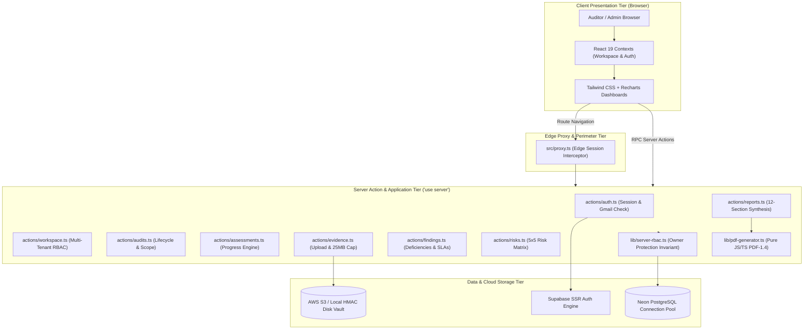

# Audit Platform: Enterprise Governance, Risk & Compliance (GRC) System

[](https://nextjs.org/)
[](https://react.dev/)
[](https://www.typescriptlang.org/)
[-336791?style=flat&logo=postgresql)](https://neon.tech/)
[](https://supabase.com/)
[](https://aws.amazon.com/s3/)
[](https://playwright.dev/)
[](https://auditplatform-nu.vercel.app/)

An enterprise-grade, multi-tenant Governance, Risk, and Compliance (GRC) management system engineered with the **Next.js 16 App Router**, **React 19**, **TypeScript**, and **PostgreSQL**. The platform replaces fragile spreadsheets and fragmented communication with an automated, end-to-end compliance management workflow—spanning multi-organization workspaces, formal 5-stage audit lifecycles, baseline framework mappings (ISO/IEC 27001, NIST CSF 2.0, NIST SP 800-53, SOC 2), a persistent dual-tier evidence vault, finding and remediation SLA management, an enterprise $5 \times 5$ risk matrix, and a zero-dependency in-memory PDF-1.4 reporting engine.

---

## 🌐 Live Production Deployment

- **Live URL**: [https://auditplatform-nu.vercel.app/](https://auditplatform-nu.vercel.app/)
- **Hosting Environment**: Vercel Serverless (Region: `iad1` - US East Washington D.C.)
- **Edge Routing**: Next.js 16 Edge Proxy enforcing authenticated session validation and Gmail domain verification.

---

## 🏛️ System Architecture & Mental Model



---

## 🚀 Key Architectural Features

1. **Deterministic 5-Stage Audit Lifecycle**:
   - Manages engagements systematically across `Planning` $\rightarrow$ `Fieldwork` $\rightarrow$ `Review` $\rightarrow$ `Reporting` $\rightarrow$ `Completed`.
2. **Mathematical Progress Recalculation Engine**:
   - Calculates audit completion automatically based on evaluated controls:
     $$\text{Progress} = \operatorname{round}\left(\frac{N_{\text{Implemented}} + N_{\text{Not Applicable}} + 0.5 \times N_{\text{Partially Implemented}}}{\text{Total Controls}} \times 100\right)$$
3. **Multi-Tenant Logical Isolation**:
   - Shared-database multi-tenancy strictly partitioned by `workspace_id`. Cross-workspace evidence linking is prevented at the database mutation layer.
4. **5-Tier Cryptographic RBAC with Owner Protection**:
   - Granular roles: `Owner`, `Admin`, `Auditor`, `Reviewer`, and `Viewer`. Enforces a strict security invariant where `Admin` accounts cannot modify or elevate accounts to `Owner`.
5. **Dual-Tier Evidence Vault**:
   - Seamlessly routes binary uploads to **AWS S3** with 15-minute pre-signed URLs, or falls back to **Local Persistent Disk** (`.storage/evidence`) protected by HMAC-SHA256 download tokens validated via constant-time buffer comparison (`timingSafeEqual`). Max size: 25MB.
6. **Pure TypeScript/JavaScript PDF-1.4 Compiler**:
   - Generates compliant, publication-ready multi-page compliance reports in memory in **under 150 milliseconds**, eliminating the 300MB container bloat and cold-start latency of Puppeteer/Chromium.
7. **Append-Only Immutable Audit Trail**:
   - Full non-repudiation tracking logging every create, update, delete, and role status change with actor identity, timestamp, and JSON diffs.

---

## 📚 Complete Technical Documentation Index (26 Chapters)

For comprehensive technical, operational, and academic details, consult the dedicated documentation package in the [`docs/`](docs/) directory:

| Chapter | Title & Scope | Primary Topics Covered |
| :---: | :--- | :--- |
| [`docs/README.md`](docs/README.md) | **Documentation Portal** | Master index, reading tracks, and documentation roadmap |
| [`01`](docs/01-project-overview.md) | **Project Overview** | Executive summary, problem statement, business goals, persona profiles |
| [`02`](docs/02-scope-and-requirements.md) | **Scope & Requirements** | Non-pen-testing boundary, 40 Functional Requirements (FR-01..40), 15 NFRs |
| [`03`](docs/03-system-architecture.md) | **System Architecture** | Multi-tier architecture, 7 Mermaid topologies, sequence diagrams |
| [`04`](docs/04-technology-stack.md) | **Technology Stack** | Next.js 16, React 19, TypeScript, Neon PG, S3, PDF engine pivot |
| [`05`](docs/05-codebase-structure.md) | **Codebase Structure** | Directory breakdown, server actions, client/server boundaries |
| [`06`](docs/06-authentication.md) | **Authentication & RBAC** | Supabase SSR, `resolveAppUser`, Gmail regex validation, 5-role matrix |
| [`07`](docs/07-workspaces.md) | **Multi-Tenant Workspaces** | Logical tenant isolation, `user_workspaces`, context switching |
| [`08`](docs/08-audit-management.md) | **Audit Management** | 5-stage lifecycle, scoping parameters, dynamic progress formula |
| [`09`](docs/09-audit-plan.md) | **Audit Planning & Assessments** | Strategic plans, control assessment breakdown, evidence linking |
| [`10`](docs/10-frameworks.md) | **Compliance Frameworks** | ISO 27001, NIST CSF 2.0, NIST SP 800-53, SOC 2, certification disclaimer |
| [`11`](docs/11-evidence.md) | **Evidence Vault & Storage** | AWS S3 vs Local HMAC, signed URLs, 25MB validation, MIME whitelist |
| [`12`](docs/12-findings.md) | **Finding & Remediation** | Non-conformity lifecycle, severity ratings, remediation SLAs, 5x5 matrix |
| [`13`](docs/13-reporting.md) | **Reporting Engine & PDF** | 12-section compilation, pure TS/JS PDF-1.4 writer, JSON export |
| [`14`](docs/14-data-model.md) | **Relational Data Model** | PostgreSQL schema, 14 tables, composite indexes, Mermaid ERD |
| [`15`](docs/15-security.md) | **Security Architecture** | Threat model (STRIDE), SQL parameterization, Owner protection invariant |
| [`16`](docs/16-testing.md) | **Verification & Testing** | Playwright E2E matrix, build checks, locator drift debt analysis |
| [`17`](docs/17-deployment.md) | **Deployment & Cloud Ops** | Vercel Serverless, Neon Postgres, sanitized env vars, CI/CD |
| [`18`](docs/18-user-guide.md) | **End-User Manual** | Step-by-step user guide from signup to report export |
| [`19`](docs/19-admin-guide.md) | **Administrator Guide** | Team administration, role delegation, audit trail inspection |
| [`20`](docs/20-troubleshooting.md) | **Troubleshooting** | Problem-cause-resolution matrix across auth, DB, storage, and RBAC |
| [`21`](docs/21-limitations.md) | **System Limitations** | Honest technical limitations, partial mock routes, single-region S3 |
| [`22`](docs/22-roadmap.md) | **Technical Roadmap** | Immediate (P0), Short-Term (P1), Medium-Term (P2), Long-Term (P3) |
| [`23`](docs/23-academic-project.md) | **Academic Capstone** | Final-year dissertation writeup, methodology, quantitative results |
| [`24`](docs/24-viva-guide.md) | **Viva Voce Defense** | 30s pitch, 1m & 5m demo scripts, 15 tough examiner Q&A defenses |
| [`25`](docs/25-glossary-and-references.md) | **Glossary & References** | Authoritative GRC definitions, standard citations (ISO, NIST, AICPA) |

---

## 🛠️ Local Development Quickstart

### Prerequisites
- **Node.js**: v20.x or later
- **npm**: v10.x or later
- **PostgreSQL Database**: Local PostgreSQL instance or free [Neon Serverless Postgres](https://neon.tech/) account.

### 1. Clone & Install Dependencies
```bash
git clone https://github.com/your-org/audit-platform.git
cd audit-platform
npm install
```

### 2. Configure Environment Variables
Copy `.env.example` to `.env.local`:
```bash
cp .env.example .env.local
```
Configure your database and Supabase keys (see [Section 17](docs/17-deployment.md) for details):
```env
DATABASE_URL=postgresql://[user]:[password]@[endpoint].neon.tech/[dbname]?sslmode=require
NEXT_PUBLIC_SUPABASE_URL=https://your-project.supabase.co
NEXT_PUBLIC_SUPABASE_PUBLISHABLE_KEY=your-supabase-key
NEXT_PUBLIC_SITE_URL=http://localhost:3000
```
*(S3 configuration is optional; if omitted, the system defaults to persistent local disk storage automatically).*

### 3. Run Development Server
```bash
npm run dev
```
Open [http://localhost:3000](http://localhost:3000) in your browser. The database schema and baseline framework controls will auto-seed on the first request.

### 4. Verification & Testing Commands
```bash
# Static type checking
npm run typecheck

# Code quality linting
npm run lint

# Compile production build
npm run build

# Run Playwright E2E browser tests
npx playwright test
```

---

## ⚖️ Legal & Certification Disclaimer

The Audit Platform is an internal governance, risk management, and audit preparation software tool. Utilizing this platform or reaching 100% compliance does **not** grant formal accreditation under ISO/IEC 27001 or constitute an official AICPA SOC 2 Type II examination report. Formal certification requires an independent assessment performed by an **Accredited Certification Body (CB)** or a licensed **independent CPA firm**.

---

## 📄 License

This project is licensed under the MIT License.
