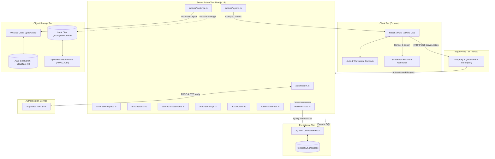
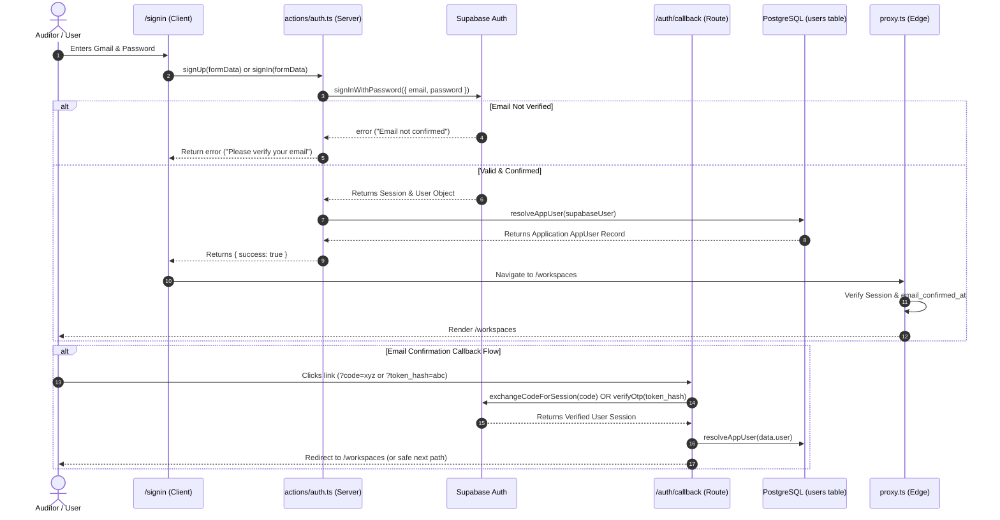
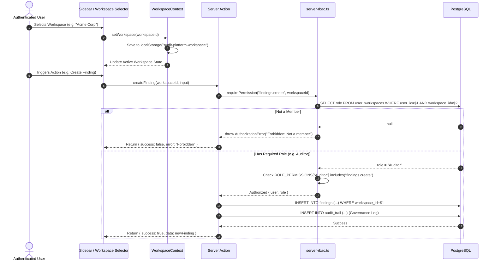
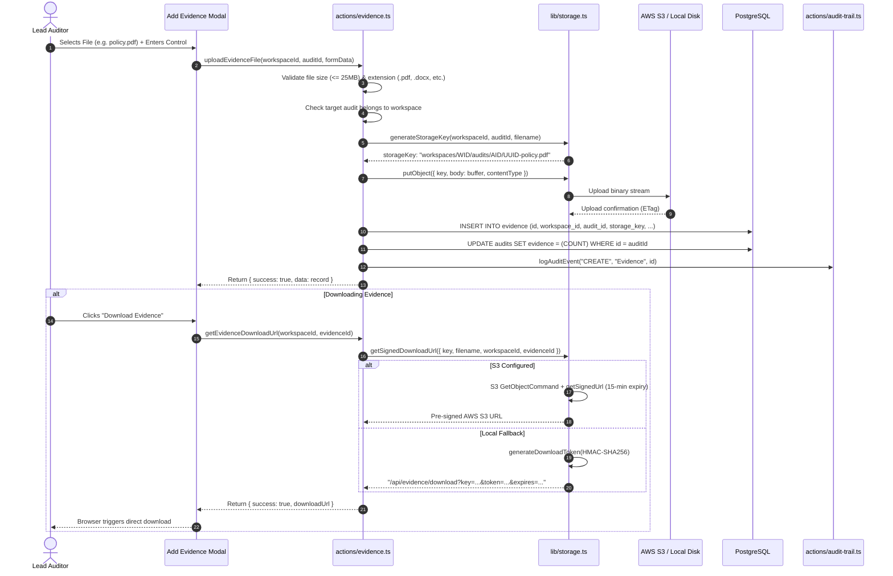
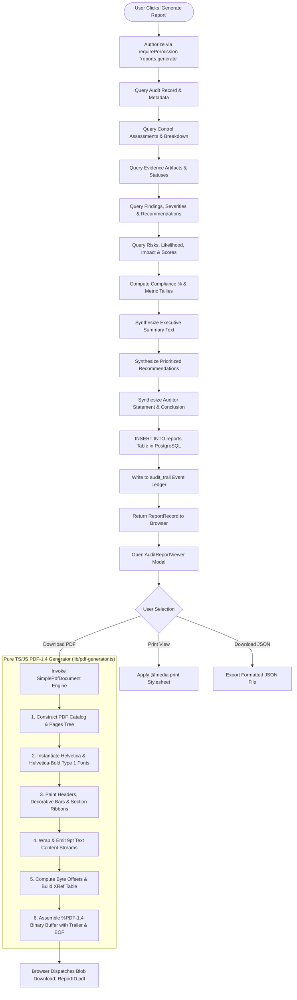

# Chapter 3: System Architecture & Data Flow

## 3.1 Architectural Overview

The **Audit Platform** is constructed as a modern, multi-tier cloud application built upon **Next.js 16.3.4 (App Router)** and **React 19.2.8**, running on the **Vercel Edge Serverless Platform**. Rather than relying on a separate custom backend microservice (e.g. Express or NestJS), the application utilizes Next.js 16 native **Server Actions (`'use server'`)** as a type-safe RPC boundary, coupled with direct PostgreSQL connection pooling and managed cloud services for authentication and object storage.

```
┌────────────────────────────────────────────────────────────────────────────┐
│                              CLIENT TIER                                   │
│  React 19 SPA (Client Components, Tailwind v4, Lucide Icons, Recharts)     │
│  Context Providers: AuthContext • WorkspaceContext • AuditContext          │
└─────────────────────────────────────┬──────────────────────────────────────┘
                                      │ HTTPS / Next.js Server Action RPC
┌─────────────────────────────────────▼──────────────────────────────────────┐
│                           EDGE PROXY & ROUTING                             │
│  Next.js 16 Edge Proxy (src/proxy.ts) • Session Verification & Redirects   │
│  App Router: /dashboard, /audits, /evidence, /findings, /reports, etc.     │
└─────────────────────────────────────┬──────────────────────────────────────┘
                                      │
┌─────────────────────────────────────▼──────────────────────────────────────┐
│                            SERVER ACTION TIER                              │
│  Type-Safe Server Actions (src/actions/*.ts) • Server-Side RBAC Validation │
│  Audit Trail Logger • PDF Generator Engine • S3 Request Presigner          │
└──────────────┬──────────────────────┬──────────────────────┬───────────────┘
               │                      │                      │
┌──────────────▼──────┐┌──────────────▼──────┐┌──────────────▼───────────────┐
│   SUPABASE AUTH     ││  REMOTE POSTGRESQL  ││     OBJECT STORAGE VAULT     │
│ • Supabase SSR      ││ • Neon Tech / Hosted││ • AWS S3 Object Storage      │
│ • PKCE Code Exchange││ • Direct Pool ('pg')││ • Pre-Signed URLs (15-min)   │
│ • Token Hash OTP    ││ • Relational Tables ││ • Local Persistent Disk      │
│ • JWT Cookies       ││ • Cascade Integrity ││   Fallback (.storage/evd)   │
└─────────────────────┘└─────────────────────┘└──────────────────────────────┘
```

---

## 3.2 Tier-by-Tier Architectural Breakdown

### 1. Presentation & State Tier (Client)
- **React 19 Client Components**: Highly responsive, interactive components utilizing React 19 hooks (`useState`, `useEffect`, `useCallback`, `useMemo`).
- **Context Architecture**:
  - `AuthContext.tsx`: Distributes authenticated user identity and role across all client trees.
  - `WorkspaceContext.tsx`: Maintains the active workspace ID, synchronizes with `localStorage` (`audit-platform-workspace`), and triggers workspace reloading.
  - `AuditContext.tsx`: Caches and synchronizes the active audit list and provides CRUD dispatchers for audit records.
- **Component Styling**: Built using **Tailwind CSS v4** with a custom CSS design system defining status badges, interactive dialogs, progress bars, and high-density data tables.
- **Data Visualization**: Employs **Recharts 3.10.1** to render interactive audit status bars, finding severity distributions, risk matrices, and compliance trend lines.

### 2. Edge Proxy & Routing Tier
- **Next.js 16 Edge Proxy (`src/proxy.ts`)**: Acts as a zero-trust network ingress filter. For all incoming requests matched by `config.matcher`, the proxy:
  1. Initializes the Supabase SSR client with request cookies.
  2. Resolves `supabase.auth.getUser()`.
  3. Inspects route path against public paths (`/signin`, `/reset-password`, `/auth/callback`).
  4. Redirects unauthenticated or unverified users (`!user.email_confirmed_at`) immediately to `/signin`.
  5. Prevents verified authenticated users from visiting `/signin`, redirecting them to `/workspaces`.

### 3. Application Logic & Server Action Tier
- **Server Actions (`'use server'`)**: All data mutations and data fetching execute via server actions residing in `src/actions/`. These actions run strictly server-side in Node.js serverless execution contexts.
- **Authoritative Authorization**: Every server action calls `requirePermission(permission, workspaceId)` from `src/lib/server-rbac.ts`, verifying against PostgreSQL before touching domain tables.
- **Sanitized Governance Logging**: After every write mutation, `logAuditEvent(...)` records an immutable trace in the `audit_trail` table.

### 4. Persistence & Database Tier
- **PostgreSQL Database**: Configured for **Neon PostgreSQL** or **Supabase PostgreSQL** via `process.env.DATABASE_URL`.
- **Connection Management (`src/lib/db.ts`)**: Employs a pooled connection architecture using `pg.Pool` configured with `max: 10`, `idleTimeoutMillis: 30000`, and `connectionTimeoutMillis: 10000`. It features lazy evaluation to avoid serverless module-initialization timeouts.
- **Schema Management**: Self-bootstraps via `ensureSchema()`, executing idempotent DDL statements (`CREATE TABLE IF NOT EXISTS`, `ADD COLUMN IF NOT EXISTS`) and seeding initial GRC frameworks on first run.

### 5. Object Storage Vault Tier
- **Dual-Tier Storage Architecture (`src/lib/storage.ts`)**:
  - *Tier A (Cloud S3)*: When `S3_BUCKET`, `S3_ACCESS_KEY_ID`, and `S3_SECRET_ACCESS_KEY` are provided, files are stored in AWS S3 (or S3-compatible endpoints such as Cloudflare R2 or MinIO). Pre-signed download URLs are issued with a strict 15-minute expiration (`expiresInSeconds: 900`).
  - *Tier B (Local Persistent Disk Fallback)*: When S3 credentials are not set, files are safely persisted to `.storage/evidence` on disk. Downloads are authorized through HMAC-SHA256 signatures generated using `JWT_SECRET` and validated by `/api/evidence/download/route.ts`.

---

## 3.3 Architecture Diagrams (Mermaid)

### 3.3.1 System Architecture Diagram



---

### 3.3.2 Authentication & User Resolution Flow



---

### 3.3.3 Multi-Tenant Workspace & Authorization Flow



---

### 3.3.4 Audit 5-Stage Lifecycle & Progress Aggregation

```mermaid
stateDiagram-v2
    [*] --> Planning: createAudit() [id: AUD-YYYY-XXXX]
    
    state Planning {
        [*] --> ScopeDefinition
        ScopeDefinition --> ObjectiveSetting
        ObjectiveSetting --> AssignLead
    }
    
    Planning --> Fieldwork: updateAudit(status = "Fieldwork")
    
    state Fieldwork {
        [*] --> ControlAssessments
        ControlAssessments --> EvidenceCollection
        EvidenceCollection --> FindingIdentification
        FindingIdentification --> RiskLogging
    }
    
    Fieldwork --> Review: updateAudit(status = "Review")
    
    state Review {
        [*] --> QAInspection
        QAInspection --> EvidenceApproval
        EvidenceApproval --> RemediationReview
    }
    
    Review --> Reporting: updateAudit(status = "Reporting")
    
    state Reporting {
        [*] --> GenerateReportData
        GenerateReportData --> ExecutiveReview
        ExecutiveReview --> PDFExport
    }
    
    Reporting --> Completed: updateAudit(status = "Completed")
    
    state Completed {
        [*] --> AuditClosed
        AuditClosed --> ImmutableArchive
    }
    
    Completed --> [*]
```



---

### 3.3.5 Evidence Upload & Pre-Signed Retrieval Flow



---

### 3.3.6 Report Generation & PDF Synthesis Pipeline



---

### 3.3.7 Production Deployment Topology

```mermaid
flowchart LR
    subgraph Internet ["Public Internet"]
        ClientBrowser[Auditor Browser / Mobile Client]
    end

    subgraph VercelEdge ["Vercel Production Platform (auditplatform-nu.vercel.app)"]
        CDN[Vercel Global Edge CDN]
        NextServer[Next.js 16 Serverless Functions]
        EdgeProxy["src/proxy.ts (Edge Runtime)"]
    end

    subgraph CloudServices ["Managed Cloud Infrastructure"]
        NeonDB[("Neon PostgreSQL Cluster (AWS us-east-2)")]
        SupaCloud[("Supabase Auth Service (HTTPS / REST)")]
        AWSS3[("AWS S3 Evidence Bucket (us-east-1)")]
    end

    ClientBrowser <-->|HTTPS / TLS 1.3| CDN
    CDN <--> EdgeProxy
    EdgeProxy <--> NextServer
    NextServer <-->|Pooled TCP (SSL Require)| NeonDB
    NextServer <-->|HTTPS API / JWT Auth| SupaCloud
    NextServer <-->|HTTPS AWS SDK v3| AWSS3
```
