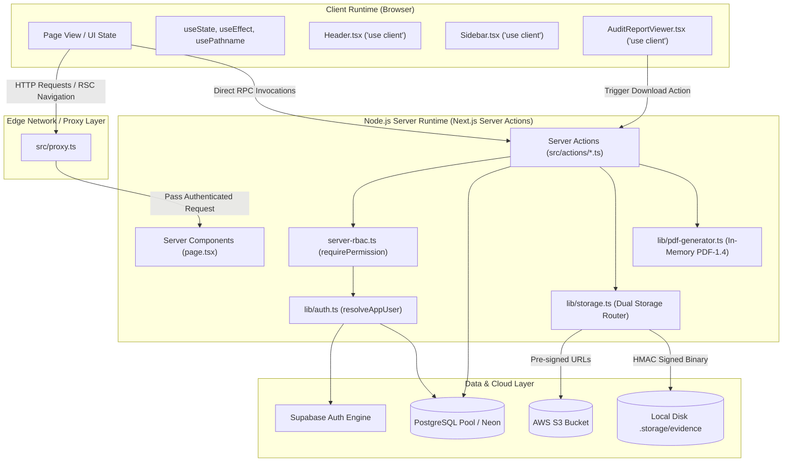

# Section 05: Codebase Structure & Directory Organization

## 1. Architectural Layout & Mental Model

The Audit Platform is architected as a modern, full-stack Next.js application leveraging the **Next.js App Router** paradigm, React 19 Server and Client Components, TypeScript static typing, and direct PostgreSQL database pooling via Node.js native drivers. 

The repository decouples client-side presentation, server-side data mutations, and persistent relational storage into cleanly separated logical tiers:

```
audit-platform/
├── docs/                       # Comprehensive technical and operational documentation (26 chapters)
├── node_modules/               # Resolved external dependencies
├── public/                     # Static client assets (SVGs, icons, logos)
├── src/                        # Complete application source code
│   ├── actions/                # Next.js Server Actions ("use server" RPC layer)
│   ├── app/                    # Next.js App Router hierarchical routes & layouts
│   ├── components/             # Reusable UI component modules
│   ├── lib/                    # Shared libraries, utilities, DB pool, auth, RBAC, storage
│   └── proxy.ts                # Edge HTTP proxy middleware for route interception & auth enforcement
├── tests/                      # End-to-End browser test automation suites (Playwright)
├── .env.example                # Sanitized template for local and production environment variables
├── eslint.config.mjs           # Flat ESLint configuration rules
├── next.config.ts              # Next.js bundler and runtime configuration
├── package.json                # Project dependencies, scripts, and engine specifications
├── playwright.config.ts        # Playwright E2E configuration and browser matrix
├── postcss.config.mjs          # PostCSS processing pipeline (Tailwind CSS engine)
├── tailwind.config.ts          # Utility-first CSS theme design tokens and dark mode styling
└── tsconfig.json               # TypeScript strict compiler configuration and module path aliases
```

---

## 2. Source Tree (`src/`) Detailed Breakdown

The `src/` directory contains all executable logic, divided strictly across five functional domains:

```
src/
├── actions/                     # Server Action Mutators & Data Fetchers ("use server")
│   ├── assessments.ts           # Control assessment CRUD, initialization & progress calculation
│   ├── audit-plans.ts           # Audit planning cycles, milestones & framework mappings
│   ├── audit-trail.ts           # Immutable append-only audit event logging engine
│   ├── audits.ts                # Core audit lifecycle, scoping, metrics & status transitions
│   ├── auth.ts                  # User signup, session resolution & verification triggers
│   ├── dashboard.ts             # Aggregated metric queries, risk matrices & recent activity
│   ├── evidence.ts              # Evidence metadata tracking, status workflow & storage bridging
│   ├── findings.ts              # Finding discovery, severity scoring, SLA & remediation
│   ├── frameworks.ts            # Compliance framework definitions & control cataloging
│   ├── reports.ts               # 12-section audit report compilation & metadata persistence
│   ├── risks.ts                 # 5x5 risk matrix scoring, residual calculation & mitigation
│   ├── search.ts                # Cross-entity unified search across audits, findings & controls
│   └── workspace.ts             # Multi-tenant workspace isolation, member RBAC & invitations
│
├── app/                         # App Router File-System Routing (28 routes)
│   ├── administration/          # Workspace member administration, invitations & role updates
│   ├── api/                     # Dedicated HTTP API Handlers
│   │   └── evidence/
│   │       └── download/
│   │           └── route.ts     # HMAC-SHA256 authenticated binary streaming route
│   ├── audit-plans/             # Audit planning cycle listing, creation & detail screens
│   ├── audit-trail/             # Workspace-level immutable activity audit log viewer
│   ├── audits/                  # Core Audit Management Domain
│   │   ├── [id]/                # Single Audit Root Hub
│   │   │   ├── evidence/        # Audit-scoped evidence collection vault
│   │   │   ├── findings/        # Audit-scoped findings & corrective actions
│   │   │   │   └── [findingId]/ # In-depth finding detail, remediation plan & discussion
│   │   │   ├── remediation/     # Audit-scoped remediation tracking & SLA dashboard
│   │   │   ├── reports/         # Dynamic 12-section report viewer & PDF/JSON export hub
│   │   │   ├── risks/           # Audit-specific risk registry & matrix
│   │   │   └── page.tsx         # Audit summary dashboard & control assessment matrix
│   │   └── page.tsx             # All Audits index table, filtering & creation modal
│   ├── auth/                    # OAuth & Email Verification Callbacks
│   │   └── callback/
│   │       └── route.ts         # Supabase PKCE code exchange & session finalization
│   ├── calendar/                # Audit milestones, review deadlines & schedule calendar
│   ├── control-library/         # Unified baseline control repository across frameworks
│   ├── dashboard/               # Executive dashboard, KPIs, compliance trends & quick actions
│   ├── evidence/                # Workspace-wide evidence repository & verification queue
│   ├── findings/                # Global workspace findings registry & severity analytics
│   ├── frameworks/              # Framework overview, control mapping & gap analysis
│   ├── remediation/             # Global remediation task tracker & SLA escalation monitor
│   ├── reports/                 # Global generated report archive & audit summary downloads
│   ├── reset-password/          # Self-service credential recovery & update workflow
│   ├── risk-management/         # Enterprise 5x5 risk matrix & asset risk register
│   ├── settings/                # User profile, notification preferences & workspace settings
│   ├── signin/                  # Authentication gateway (Email/Password & OTP verification)
│   ├── tasks/                   # Action item assignment, reviewer workflows & notifications
│   ├── workspaces/              # Organization switcher & new workspace creation wizard
│   ├── globals.css              # Tailwind CSS directives, theme variables & custom utilities
│   ├── layout.tsx               # Root application layout (HTML/Body, Fonts, Theme Provider)
│   └── page.tsx                 # Root landing page / redirector to /signin or /dashboard
│
├── components/                  # Reusable UI Presentation Components
│   ├── layout/                  # Shell Navigation & Framework Components
│   │   ├── Header.tsx           # Top navigation bar, workspace switcher, notifications, user menu
│   │   └── Sidebar.tsx          # Left-hand collapsable sidebar navigation with active state
│   └── reports/                 # Reporting Presentation Components
│       └── AuditReportViewer.tsx# Interactive in-browser report renderer with print/export
│
├── lib/                         # Core Architecture, Providers & Infrastructure Abstractions
│   ├── supabase/                # Supabase SSR Auth Client Providers
│   │   ├── client.ts            # Client-side browser Supabase client (createBrowserClient)
│   │   └── server.ts            # Server-side cookie-aware Supabase client (createServerClient)
│   ├── auth.ts                  # Session resolution, user extraction (`resolveAppUser`)
│   ├── db.ts                    # PostgreSQL connection pool (`pg.Pool`), auto-DDL & query wrapper
│   ├── findings-types.ts        # Pure TypeScript definitions for finding & risk interfaces
│   ├── grcData.ts               # Client-side state models, mock seeds & fallback definitions
│   ├── pdf-generator.ts         # Pure TypeScript/JavaScript PDF-1.4 binary compilation engine
│   ├── rbac.ts                  # Client-side RBAC role permissions, matrix & utility hooks
│   ├── server-rbac.ts           # Server-side cryptographic permission enforcers & guards
│   └── storage.ts               # Dual-tier binary storage (AWS S3 & Local HMAC disk vault)
│
└── proxy.ts                     # Edge routing proxy validating auth headers & session state
```

---

## 3. Server Actions Layer (`src/actions/`)

The Server Actions layer acts as the Remote Procedure Call (RPC) interface between client UI components and the backend PostgreSQL database. All files in this directory declare `"use server"` at top-of-file.

### 3.1 Key Action Modules & Method Contracts

| Action Module | Primary Methods | Security & Governance Responsibilities |
| :--- | :--- | :--- |
| `workspace.ts` | `getUserWorkspaces`, `getWorkspaceMembers`, `addWorkspaceMember`, `updateWorkspaceMember`, `removeWorkspaceMember`, `createWorkspace` | Resolves multi-tenant tenancy, enforces `requireRoleManagement` to prevent privilege escalation, manages `user_workspaces` joins. |
| `audits.ts` | `getAudits`, `getAudit`, `createAudit`, `updateAudit`, `deleteAudit` | Enforces `audits.view`, `audits.create`, `audits.update`, `audits.delete`. Computes default due dates and generates structured IDs (`AUD-YYYY-XXXXX`). |
| `assessments.ts` | `getAssessments`, `initializeAuditAssessments`, `updateAssessment` | Dynamically maps controls from the catalog to an audit, calculates completion percentages ($\text{progress} = \frac{\text{Implemented} + \text{NA} + 0.5 \times \text{Partial}}{\text{Total}} \times 100$), and updates audit progress. |
| `findings.ts` | `getFindings`, `getFinding`, `createFinding`, `updateFinding`, `deleteFinding` | Validates severity ratings, enforces finding lifecycle states, links to controls and evidence, prevents cross-workspace data leakage. |
| `evidence.ts` | `getEvidenceList`, `getEvidenceItem`, `createEvidence`, `updateEvidence`, `deleteEvidence`, `getEvidenceDownloadUrl` | Validates file size (max 25MB), determines storage tier (S3 vs local), creates HMAC-SHA256 download tokens, logs access events. |
| `reports.ts` | `compileAuditReport`, `getAuditReport`, `downloadReportPdf` | Queries 12 distinct audit subsystems, compiles report metadata, persists snapshot to `reports` table, invokes `generatePdf14` binary generator. |
| `audit-trail.ts` | `logAuditEvent`, `getAuditTrail` | Writes append-only immutable records to `audit_trail` table capturing `user_id`, `workspace_id`, `action`, `entity_type`, `entity_id`, and JSON payload. |

---

## 4. Component Architecture & Client/Server Boundaries

Next.js 16 enforces strict separation between React Server Components (RSC) and Client Components.



### 4.1 Boundary Enforcement Rules
1. **Server Actions (`"use server"`)**:
   - Reside strictly in `src/actions/` or specific inline API routes.
   - Never expose raw database client instances or connection strings to client code.
   - Always resolve user identity via `getSession()` and enforce RBAC via `requirePermission(perm, workspaceId)`.
2. **Client Components (`"use client"`)**:
   - Reside in `src/components/` and interactive page containers.
   - Handle UI state, modals, tabs, chart rendering (Recharts requires DOM measurements), and client-side sorting.
   - Invoke Server Actions asynchronously via `startTransition` or direct promise resolution.
3. **Route Interception (`src/proxy.ts`)**:
   - Executes at the edge runtime before page rendering.
   - Intercepts requests to protected routes (`/dashboard`, `/audits`, `/settings`, etc.).
   - Inspects Supabase auth session tokens; redirects unauthenticated users to `/signin`.

---

## 5. Storage and File Architecture

The application implements a zero-external-dependency local storage fallback alongside production AWS S3 compatibility:

```
c:\Users\...\audit-platform ai studio\
├── .storage/
│   └── evidence/               # Local persistent binary directory (gitignored)
│       └── [workspace_id]/
│           └── [audit_id]/
│               └── [file_uuid]-[sanitized_filename]
```

When `AWS_S3_BUCKET` is undefined, `src/lib/storage.ts` writes binary streams directly to `.storage/evidence` and issues HMAC-SHA256 signed tokens. These tokens are consumed by the streaming handler at `/api/evidence/download/route.ts`, ensuring that files are never publicly exposed or directly browseable without an active session and signed token.

---

## 6. Build, Compilation, and Configuration Artifacts

- **`next.config.ts`**:
  - Sets `serverExternalPackages: ["bcryptjs", "pg", "@aws-sdk/client-s3", "@aws-sdk/s3-request-presigner"]` to prevent Turbopack from attempting to bundle native C++ or Node.js binary bindings into browser bundles.
  - Sets `reactCompiler: false` for strict React 19 compatibility.
- **`tsconfig.json`**:
  - Configures `@/*` mapping directly to `./src/*`.
  - Enforces `strict: true`, `noEmit: true`, and `isolatedModules: true`.
- **`playwright.config.ts`**:
  - Directs test execution against local development server (`http://localhost:3000`) across Chromium, Firefox, and WebKit engines.
