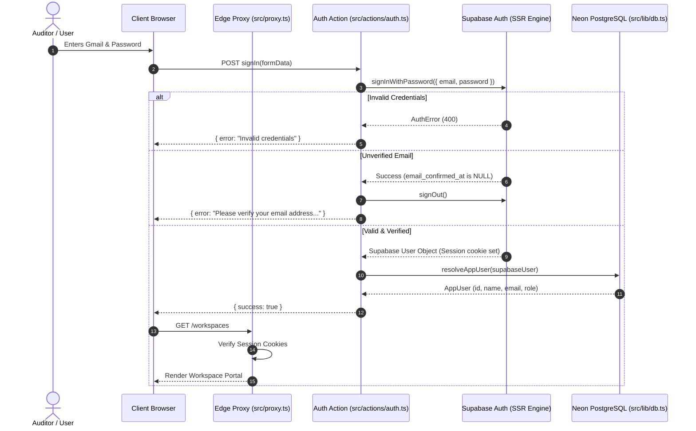

# Section 06: Authentication & Authorization (RBAC)

## 1. Authentication Architecture & Overview

The Audit Platform utilizes a hybrid authentication and identity resolution architecture combining **Supabase Auth (SSR Engine)** for cryptographic credential verification and session management with an internal **PostgreSQL `users` repository** for application identity, workspace membership, and Role-Based Access Control (RBAC).



---

## 2. Supabase SSR Integration & Session Management

Session tokens are handled using `@supabase/ssr` with HttpOnly, Secure, SameSite cookies. The application defines two client providers:

1. **Client Provider (`src/lib/supabase/client.ts`)**:
   - Uses `createBrowserClient` to manage authentication state in browser client components.
2. **Server Provider (`src/lib/supabase/server.ts`)**:
   - Uses `createServerClient` wrapped around Next.js `cookies()` store from `next/headers`.
   - Allows asynchronous reading and mutation of session cookies within Next.js Server Components, Server Actions, and API Route Handlers.

---

## 3. Account Lifecycle & Strict Registration Policies

### 3.1 Strict Gmail Domain Validation
To protect against automated spam registrations, disposable domains, and unauthorized external signups, `src/actions/auth.ts` enforces strict domain validation:

$$\text{Regex Pattern: } \texttt{\textasciicircum[a-zA-Z0-9.\_\%+-]+@(gmail\textbackslash.com|googlemail\textbackslash.com)\$}$$

Any submission outside `@gmail.com` or `@googlemail.com` is rejected before invoking Supabase API endpoints.

### 3.2 Email Verification & Confirmation Enforcement
- All newly created accounts require explicit email confirmation.
- Supabase sends an OTP verification code or magic link containing either a `code` (PKCE flow) or `token_hash`.
- The verification endpoint `/app/auth/callback/route.ts` exchanges the cryptographic code or verifies the token hash via `supabase.auth.verifyOtp({ token_hash, type })`.
- In `src/lib/auth.ts:getSession()`, any session where `user.email_confirmed_at` is `null` is rejected as unauthenticated.

---

## 4. Identity Synchronization (`resolveAppUser`)

When a user signs in or completes email confirmation, their Supabase Auth record must map deterministically to an internal PostgreSQL `users` row. The function `resolveAppUser` in `src/lib/auth.ts` executes a 3-step idempotent resolution algorithm:

1. **Match by `supabase_user_id`**:
   - Queries `SELECT id, name, email, role FROM users WHERE supabase_user_id = $1`.
   - If found, syncs any missing display names from Supabase user metadata and returns the `AppUser`.
2. **Match by `email` and Link**:
   - Queries `SELECT id, name, email, role FROM users WHERE LOWER(email) = LOWER($1)`.
   - If found, executes `UPDATE users SET supabase_user_id = $1, name = $2 WHERE id = $3` to bind the Supabase UUID to the existing internal user ID without altering historical audit assignments.
3. **New User Provisioning & Initial Workspace Seeding**:
   - If no match exists, wraps the creation in an atomic database transaction (`db.transaction`).
   - Inserts the user with default application role `Viewer`.
   - **First User Boost**: Queries `SELECT COUNT(*) FROM users`. If this is the very first user in the database ($N = 0$), creates a default workspace `"My Workspace"` and assigns the user the authoritative `Owner` role in `user_workspaces`.

---

## 5. Five-Tier Role-Based Access Control (RBAC) Matrix

The platform implements a fine-grained, 5-tier role hierarchy defined in `src/lib/rbac.ts` and cryptographically enforced on the server in `src/lib/server-rbac.ts`.

### 5.1 Role Definitions
- **Owner**: Complete authority over the workspace, including destructive deletion, member role elevation to Owner, billing/workspace settings, and complete audit management.
- **Admin**: Full administrative power over team members, audits, controls, and reports. Protected from modifying or removing `Owner` accounts.
- **Auditor**: Field operational specialist. Can create and update audits, audit plans, control assessments, upload/delete evidence, log findings, and generate reports. Cannot manage users or workspace settings.
- **Reviewer**: Quality assurance and oversight persona. Can view audits, update/approve control assessments, update finding statuses and risk ratings, and review reports. Cannot create new audits or delete evidence.
- **Viewer**: Read-only auditor or executive stakeholder. Can inspect audits, controls, evidence metadata, findings, and reports without write or mutate privileges.

### 5.2 Authoritative Permission Matrix

| System Permission | Owner | Admin | Auditor | Reviewer | Viewer |
| :--- | :---: | :---: | :---: | :---: | :---: |
| `workspace.manage` | Yes | Yes | No | No | No |
| `roles.manage` | Yes | Yes (Non-Owner) | No | No | No |
| `users.view` / `create` / `update` / `delete` | Yes | Yes | No | No | No |
| `audits.view` | Yes | Yes | Yes | Yes | Yes |
| `audits.create` / `audits.update` | Yes | Yes | Yes | No | No |
| `audits.delete` | Yes | Yes | No | No | No |
| `audit_plans.view` | Yes | Yes | Yes | Yes | Yes |
| `audit_plans.create` / `update` | Yes | Yes | Yes | No | No |
| `audit_plans.delete` | Yes | Yes | No | No | No |
| `assessments.view` | Yes | Yes | Yes | Yes | Yes |
| `assessments.create` | Yes | Yes | Yes | No | No |
| `assessments.update` | Yes | Yes | Yes | Yes | No |
| `evidence.view` | Yes | Yes | Yes | Yes | Yes |
| `evidence.create` / `delete` | Yes | Yes | Yes | No | No |
| `evidence.update` | Yes | Yes | No | No | No |
| `findings.view` | Yes | Yes | Yes | Yes | Yes |
| `findings.create` | Yes | Yes | Yes | No | No |
| `findings.update` | Yes | Yes | Yes | Yes | No |
| `findings.delete` | Yes | Yes | No | No | No |
| `risks.view` | Yes | Yes | Yes | Yes | Yes |
| `risks.create` | Yes | Yes | Yes | No | No |
| `risks.update` | Yes | Yes | Yes | Yes | No |
| `risks.delete` | Yes | Yes | No | No | No |
| `reports.view` | Yes | Yes | Yes | Yes | Yes |
| `reports.generate` | Yes | Yes | Yes | Yes | No |
| `audit_trail.view` | Yes | Yes | Yes | Yes | No |

---

## 6. Server-Side RBAC Enforcement (`src/lib/server-rbac.ts`)

Client-side checks (`hasPermission()`) are purely for rendering conditional UI elements (e.g., hiding a "Delete Audit" button). **All mutations and data retrievals are guarded server-side**:

```typescript
// src/lib/server-rbac.ts
export async function requirePermission(permission: Permission, workspaceId: string) {
  if (!workspaceId) {
    throw new AuthorizationError("Forbidden: Workspace ID is required for authorization");
  }

  const session = await getSession();
  if (!session || !session.user) {
    throw new AuthorizationError("Unauthorized: No active session");
  }

  // Authoritative database check scoped to workspace
  const membership = await db.queryOne<{ role: string }>(
    'SELECT role FROM user_workspaces WHERE user_id = $1 AND workspace_id = $2',
    [session.user.id, workspaceId]
  );

  if (!membership) {
    throw new AuthorizationError("Forbidden: User is not a member of this workspace");
  }

  const role = membership.role as Role;
  if (!hasPermission(role, permission)) {
    throw new AuthorizationError(`Forbidden: Requires ${permission} permission in this workspace`);
  }

  return { user: session.user, role };
}
```

### 6.1 Owner Protection Invariant (`requireRoleManagement`)
Privilege escalation is prevented by `requireRoleManagement`:
- An `Admin` can invite new members or change roles between `Viewer`, `Reviewer`, and `Auditor`.
- If an `Admin` attempts to promote any user to `Owner`, or alter the role of an existing `Owner`, the function throws `AuthorizationError("Forbidden: Only Owners can manage Owner roles")`.

---

## 7. Authentication Error Handling & Open Redirect Protection

In `/app/auth/callback/route.ts`, strict redirect URL sanitization is enforced against phishing and open redirect vulnerabilities:

```typescript
// Validate redirect destination against open redirects: must start with single '/' and not '//'
let safeNext = '/workspaces';
if (next && next.startsWith('/') && !next.startsWith('//') && !next.startsWith('/\\')) {
  safeNext = next;
} else if (type === 'recovery') {
  safeNext = '/reset-password';
}
```

If Supabase returns an authentication error parameter (such as `otp_expired` or `access_denied`), the callback catches the query parameters and safely redirects to `/signin?error=...` with user-friendly error banners.
