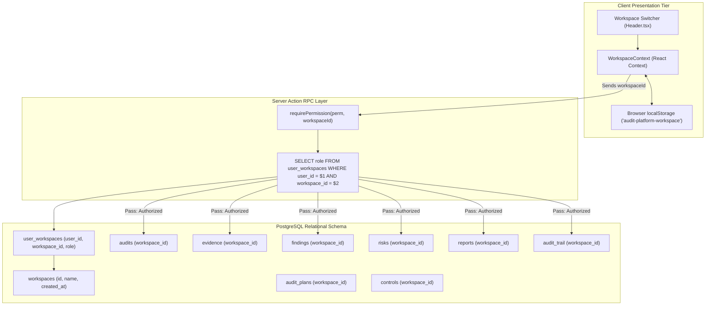

# Section 07: Multi-Tenant Workspaces & Organization Isolation

## 1. Multi-Tenancy Architecture

The Audit Platform is built on a **shared-database, logical-isolation multi-tenant architecture**. Rather than requiring separate database instances per customer organization, tenant boundaries are enforced logically at both the relational schema level and the server action layer.



---

## 2. Relational Schema & Tenant Data Model

Multi-tenancy relies on two core tables and strict foreign-key referencing across all business entities:

### 2.1 The `workspaces` Table
Stores high-level organization metadata:
```sql
CREATE TABLE IF NOT EXISTS workspaces (
  id VARCHAR(64) PRIMARY KEY,
  name VARCHAR(255) NOT NULL,
  created_at TIMESTAMP WITH TIME ZONE DEFAULT CURRENT_TIMESTAMP
);
```

### 2.2 The `user_workspaces` Pivot Table
Defines tenant membership and workspace-scoped authorization:
```sql
CREATE TABLE IF NOT EXISTS user_workspaces (
  user_id VARCHAR(64) NOT NULL,
  workspace_id VARCHAR(64) NOT NULL,
  role VARCHAR(32) NOT NULL DEFAULT 'Viewer',
  created_at TIMESTAMP WITH TIME ZONE DEFAULT CURRENT_TIMESTAMP,
  PRIMARY KEY (user_id, workspace_id),
  FOREIGN KEY (user_id) REFERENCES users(id) ON DELETE CASCADE,
  FOREIGN KEY (workspace_id) REFERENCES workspaces(id) ON DELETE CASCADE
);
```

### 2.3 Universal Workspace Scoping
Every domain entity table enforces workspace scoping via a non-nullable `workspace_id` column:
- `audits.workspace_id`
- `audit_plans.workspace_id`
- `control_assessments.workspace_id`
- `evidence.workspace_id`
- `findings.workspace_id`
- `risks.workspace_id`
- `reports.workspace_id`
- `audit_trail.workspace_id`

Baseline framework controls (`controls`) support a nullable `workspace_id`. When `workspace_id IS NULL`, the control is a global system baseline (such as ISO 27001 or NIST CSF 2.0). Custom organization controls set `workspace_id = $workspaceId` to remain private to that organization.

---

## 3. Workspace Context & Switching Lifecycle

On the frontend, active tenant context is managed via `src/context/WorkspaceContext.tsx`:

1. **Initial Hydration**:
   - The root layout or page retrieves the user's available organizations via `getUserWorkspaces()`.
   - `WorkspaceProvider` initializes state from the server payload.
2. **Client-Side Persistence**:
   - `WorkspaceContext` reads `localStorage.getItem("audit-platform-workspace")`.
   - If a valid workspace ID is cached and exists in the user's membership list, it is selected. Otherwise, the first workspace in the list is selected and written to `localStorage`.
3. **Switching Mechanism**:
   - The user selects a different workspace in `Header.tsx` or `/workspaces`.
   - `setWorkspace(id)` updates state and `localStorage`.
   - Next.js re-renders active dashboard routes, triggering new Server Action fetches with the updated `workspaceId`.

---

## 4. Query Isolation & Leakage Prevention

To prevent cross-tenant data leakage (IDOR vulnerabilities), **all SQL queries in `src/actions/*.ts` filter explicitly by `workspace_id = $x`**:

```typescript
// Example: Safe audit query in src/actions/audits.ts
export async function getAudit(workspaceId: string, auditId: string) {
  await requirePermission("audits.view", workspaceId);
  const audit = await db.queryOne(
    `SELECT * FROM audits WHERE id = $1 AND workspace_id = $2`,
    [auditId, workspaceId]
  );
  if (!audit) return { success: false, error: "Audit not found" };
  return { success: true, data: audit };
}
```

Even if a malicious user guesses an audit UUID belonging to another organization, supplying their own `workspaceId` yields zero rows because the row's `workspace_id` does not match.

---

## 5. Member Management & Invitation Lifecycle

Workspace administration is conducted in `/administration` and powered by `src/actions/workspace.ts`:

### 5.1 Listing Members (`getWorkspaceMembers`)
Queries `users` joined with `user_workspaces` for the active `workspace_id`.

### 5.2 Adding Existing Registered Users (`addWorkspaceMember`)
1. Checks that the invoking user has `roles.manage` permission.
2. Resolves target user by email.
3. Inserts into `user_workspaces (user_id, workspace_id, role)`.
4. Emits an immutable audit log event: `CREATE Member`.

### 5.3 Provisioning New Users Directly (`createUserWithWorkspaceMember`)
1. Checks `requireRoleManagement(role, workspaceId)`.
2. Hashes a default password using `bcrypt.hash(password, 10)`.
3. In a transaction:
   - Inserts new user into `users` with default role `Viewer`.
   - Inserts membership into `user_workspaces` with the requested tenant role (`Auditor`, `Reviewer`, etc.).
4. Emits an immutable audit log event.

### 5.4 Member Role Updates (`updateWorkspaceMember`)
- Users cannot change their own role (prevents self-lockout or privilege escalation).
- Prevents non-Owners from modifying any user with the `Owner` role.
- Emits an immutable `STATUS_CHANGE Member` audit event.

### 5.5 Member Removal (`removeWorkspaceMember`)
- Users cannot remove themselves.
- Non-Owners cannot remove Owners.
- Deletes row from `user_workspaces`. All user data in other workspaces remains unaffected.

---

## 6. Audit Trail Logging for Workspace Operations

Every workspace mutation produces an append-only log record in `audit_trail`:
- `CREATE Workspace`: Emitted when an organization is initially founded.
- `CREATE Member`: Emitted when an auditor, reviewer, or administrator joins.
- `STATUS_CHANGE Member`: Emitted when permissions are elevated or lowered.
- `DELETE Member`: Emitted when an account is unlinked from the tenant.
