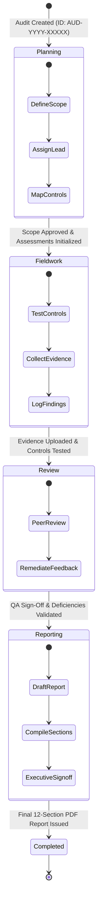

# Section 08: Audit Management & Lifecycle Engine

## 1. Audit Domain Overview

The Audit Platform manages formal IT compliance assessments through an end-to-end audit lifecycle. An audit represents a time-bound, framework-governed engagement (such as an ISO/IEC 27001:2022 surveillance audit or a SOC 2 Type II trust examination) conducted within an organization workspace.



---

## 2. Five-Stage Audit Lifecycle Model

The platform standardizes every compliance audit into five discrete lifecycle stages defined in `src/actions/audits.ts`:

| Lifecycle Stage | Operational Objective | Key Platform Actions | Access Permissions |
| :--- | :--- | :--- | :--- |
| **1. Planning** | Scoping boundaries, risk prioritization, assigning audit leads, establishing milestones. | Define audit objective, select baseline compliance framework (ISO, NIST, SOC 2), set target due dates. | Owner, Admin, Auditor |
| **2. Fieldwork** | Active technical testing, interviews, process observation, and evidence collection. | Assess controls against criteria, upload supporting artifacts to the Evidence Vault, log initial non-conformities. | Owner, Admin, Auditor |
| **3. Review** | Independent quality assurance, reviewer validation, finding challenge/acceptance. | Reviewers inspect evidence adequacy, request supplemental artifacts, update risk scores. | Owner, Admin, Auditor, Reviewer |
| **4. Reporting** | Synthesis of audit findings, root-cause analysis, executive presentation. | Trigger report compilation engine, review 12-section draft, finalize management responses. | Owner, Admin, Auditor, Reviewer |
| **5. Completed** | Formal closure of engagement and archival of evidentiary records. | Generate final immutable PDF-1.4 audit report, lock audit trail, transition to remediation tracking. | Owner, Admin |

---

## 3. Audit Scoping & Data Model

Every audit record in PostgreSQL maintains operational parameters and live counters:

```sql
CREATE TABLE IF NOT EXISTS audits (
  id VARCHAR(64) PRIMARY KEY,
  workspace_id VARCHAR(64) NOT NULL,
  name VARCHAR(255) NOT NULL,
  framework VARCHAR(64) NOT NULL,
  lead VARCHAR(128) NOT NULL,
  status VARCHAR(32) NOT NULL DEFAULT 'Planning',
  progress INTEGER NOT NULL DEFAULT 0,
  start_date DATE NOT NULL,
  due_date DATE NOT NULL,
  objective TEXT,
  scope TEXT,
  controls INTEGER NOT NULL DEFAULT 0,
  evidence INTEGER NOT NULL DEFAULT 0,
  findings INTEGER NOT NULL DEFAULT 0,
  risks INTEGER NOT NULL DEFAULT 0,
  created_at TIMESTAMP WITH TIME ZONE DEFAULT CURRENT_TIMESTAMP,
  FOREIGN KEY (workspace_id) REFERENCES workspaces(id) ON DELETE CASCADE
);
```

### 3.1 Deterministic ID Generation Scheme
Audit identifiers follow the pattern:
$$\texttt{AUD-} + \text{Year} + \texttt{-} + \text{CryptoHex}(5)$$
Example: `AUD-2026-B81A2`. This guarantees human-readable, chronological uniqueness across distributed workspaces.

---

## 4. Dynamic Progress Aggregation Engine

Audit completion percentage is calculated automatically as control assessments advance in `src/actions/assessments.ts`:

$$\text{Total Controls } (N) = \sum C_i$$

$$\text{Completed Equivalents } (E) = N_{\text{Implemented}} + N_{\text{Not Applicable}} + (0.5 \times N_{\text{Partially Implemented}})$$

$$\text{Progress Percentage } (P) = \begin{cases} 0 & \text{if } N = 0 \\ \operatorname{round}\left(\frac{E}{N} \times 100\right) & \text{if } N > 0 \end{cases}$$

This ensures that partially implemented controls contribute fractional progress ($50\%$), while "Not Applicable" controls do not penalize the team's compliance index.

---

## 5. Audit Subsystem Architecture

Within an audit (`/audits/[id]`), six dedicated modules provide comprehensive management:

```
/audits/[id]/
├── page.tsx                     # Executive summary, control assessment matrix, progress gauges
├── evidence/                    # Audit-scoped evidence collection vault (S3/local HMAC)
├── findings/                    # Audit-scoped findings, severity triage, root cause analysis
│   └── [findingId]/             # Finding detail, CAPA workflow, auditor discussions
├── remediation/                 # Corrective action plan tracker, assignees & target SLAs
├── risks/                       # 5x5 Likelihood x Impact risk matrix and residual scoring
└── reports/                     # Dynamic 12-section report viewer and PDF-1.4 generator
```

### 5.1 Auto-Initialization of Assessments
When an auditor opens a newly created audit for the first time, `getAssessments(workspaceId, auditId)` checks if assessments exist in `control_assessments`. If empty, it executes `initializeAuditAssessments(workspaceId, auditId, auditFramework)`, automatically querying the baseline catalog for controls matching the selected framework (e.g. ISO 27001:2022) and provisioning them into the audit.

---

## 6. Audit Mutations & Trail Auditing

All lifecycle events generate immutable logs in `audit_trail`:
- `createAudit`: Logs initial creation with framework, scope, and lead.
- `updateAudit`: If `status` changes (e.g., from `Fieldwork` to `Review`), logs a `STATUS_CHANGE Audit` action with previous and new states.
- `deleteAudit`: Hard deletes the audit (and cascade deletes linked assessments, evidence, and findings), logging a `DELETE Audit` record.
