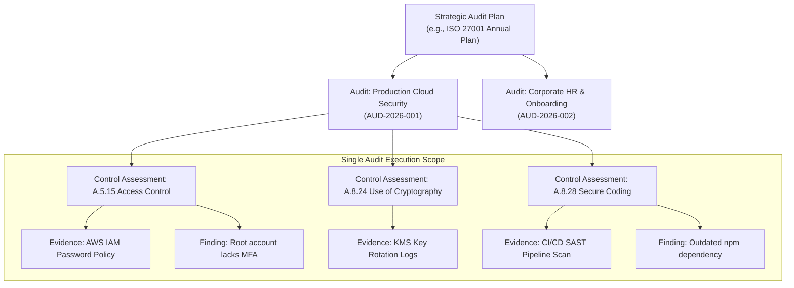

# Section 09: Audit Planning & Control Assessments

## 1. Audit Planning in Modern GRC

In enterprise Governance, Risk, and Compliance (GRC), audit planning bridges strategic compliance requirements with day-to-day testing operations. The Audit Platform handles planning across two operational tiers:

1. **Strategic Audit Plans (`audit_plans`)**: Multi-audit programs spanning calendar quarters or fiscal years (e.g., "FY2026 Comprehensive Cloud Security Program").
2. **Operational Control Assessments (`control_assessments`)**: Granular, control-by-control evaluations within an individual audit.



---

## 2. Strategic Audit Plans (`src/actions/audit-plans.ts`)

Strategic plans group multiple audits under an overarching compliance objective.

### 2.1 Audit Plan Schema
```sql
CREATE TABLE IF NOT EXISTS audit_plans (
  id VARCHAR(64) PRIMARY KEY,
  workspace_id VARCHAR(64) NOT NULL,
  audit_id VARCHAR(64),
  name VARCHAR(255) NOT NULL,
  description TEXT,
  framework VARCHAR(64) NOT NULL,
  owner VARCHAR(128) NOT NULL,
  start_date DATE NOT NULL,
  end_date DATE NOT NULL,
  audits_count INTEGER NOT NULL DEFAULT 0,
  completed_count INTEGER NOT NULL DEFAULT 0,
  status VARCHAR(32) NOT NULL DEFAULT 'Draft',
  created_at TIMESTAMP WITH TIME ZONE DEFAULT CURRENT_TIMESTAMP,
  FOREIGN KEY (workspace_id) REFERENCES workspaces(id) ON DELETE CASCADE
);
```

### 2.2 Plan Lifecycle States
- **Draft**: Initial scoping; milestones and framework definitions being drafted.
- **Approved**: Management sign-off obtained; ready for scheduling.
- **In Progress / Active**: Linked audits are currently executing fieldwork.
- **Completed**: All child audits have concluded and reports are published.
- **Archived**: Historical plan retained for multi-year compliance comparison.

---

## 3. Operational Control Assessments (`src/actions/assessments.ts`)

Control assessments represent the primary workspace for an auditor during fieldwork. Each row corresponds to one requirement evaluated against an organization's actual operational controls.

### 3.1 Control Assessment Data Model
```sql
CREATE TABLE IF NOT EXISTS control_assessments (
  id VARCHAR(64) PRIMARY KEY,
  workspace_id VARCHAR(64) NOT NULL,
  audit_id VARCHAR(64) NOT NULL,
  control_id VARCHAR(64) NOT NULL,
  control_title VARCHAR(255) NOT NULL,
  control_domain VARCHAR(128) NOT NULL,
  requirement TEXT,
  status VARCHAR(32) NOT NULL DEFAULT 'Not Started',
  assessor VARCHAR(128) DEFAULT '',
  notes TEXT DEFAULT '',
  created_at TIMESTAMP WITH TIME ZONE DEFAULT CURRENT_TIMESTAMP,
  updated_at TIMESTAMP WITH TIME ZONE DEFAULT CURRENT_TIMESTAMP,
  FOREIGN KEY (workspace_id) REFERENCES workspaces(id) ON DELETE CASCADE,
  FOREIGN KEY (audit_id) REFERENCES audits(id) ON DELETE CASCADE
);
```

### 3.2 Six-Tier Assessment Status Taxonomy

| Assessment Status | Technical Meaning | Progress Weight | Typical Criteria |
| :--- | :--- | :---: | :--- |
| **Not Started** | Control has not yet been reviewed or assigned. | $0\%$ | Baseline state upon audit creation. |
| **In Progress** | Auditor is conducting interviews or awaiting documentation. | $0\%$ | Initial documentation received; testing underway. |
| **Implemented** | Control fully satisfies requirements with verified evidentiary support. | $100\%$ | Verified policy, automated enforcement, no open defects. |
| **Partially Implemented** | Control is partially in effect but has minor gaps or missing coverage. | $50\%$ | Policy exists, but manual enforcement or incomplete rollout. |
| **Not Implemented** | Required control is missing or completely ineffective. | $0\%$ | Mandatory requirement absent; triggers an audit finding. |
| **Not Applicable** | Control is legitimately outside organizational or technical scope. | $100\%$ | E.g., physical datacenter controls for a 100% cloud-native SaaS. |

---

## 4. Assessment Initialization Algorithm

When an audit is opened, `initializeAuditAssessments` populates the assessment table:

1. **Framework Matching**: Queries the `controls` table for baseline entries matching the audit framework:
   ```sql
   SELECT id, title, description, domain FROM controls
   WHERE (framework_short ILIKE '%' || $1 || '%' OR framework_name ILIKE '%' || $1 || '%')
     AND (workspace_id IS NULL OR workspace_id = $2)
   ORDER BY id ASC
   ```
2. **Fallback Safety**: If no framework controls match the query, selects the first 12 controls in the system catalog to ensure the auditor has an operable baseline.
3. **Idempotent Insertion**: Inserts each control into `control_assessments` with status `Not Started`, using `ON CONFLICT (id) DO NOTHING`.
4. **Audit Counter Update**: Sets `audits.controls` to the total number of assessments provisioned.

---

## 5. Bidirectional Evidence and Finding Linkages

The assessment engine continuously links supporting artifacts and non-conformities dynamically using ILIKE queries across table boundaries:

```sql
SELECT ca.*,
  COALESCE((
    SELECT COUNT(*) FROM evidence e 
    WHERE e.audit_id = ca.audit_id 
      AND (e.control ILIKE '%' || ca.control_id || '%' OR e.control ILIKE '%' || ca.control_title || '%')
  ), 0) as evidence_count,
  COALESCE((
    SELECT COUNT(*) FROM findings f 
    WHERE f.audit_id = ca.audit_id 
      AND (f.control ILIKE '%' || ca.control_id || '%' OR f.control ILIKE '%' || ca.control_title || '%')
  ), 0) as findings_count
FROM control_assessments ca
WHERE ca.workspace_id = $1 AND ca.audit_id = $2
ORDER BY ca.control_id ASC;
```

This allows the UI to present real-time badges indicating exactly how many pieces of evidence support a control and whether any open deficiencies are attributed to it.
