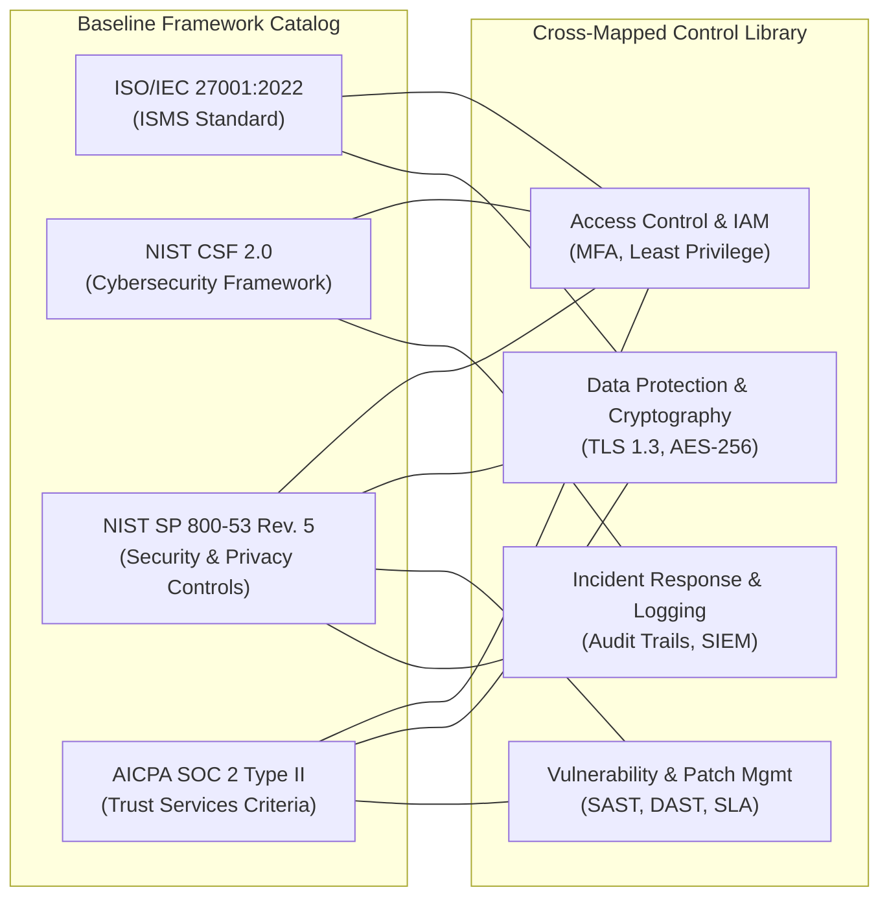

# Section 10: Compliance Frameworks & Control Mapping

## 1. Supported Compliance Frameworks

The Audit Platform provides out-of-the-box support for four globally recognized IT governance, risk management, and cybersecurity assurance frameworks:



---

## 2. In-Depth Framework Profiles

### 2.1 ISO/IEC 27001:2022 (ISMS)
- **Standard Purpose**: Specifies requirements for establishing, implementing, maintaining, and continually improving an Information Security Management System (ISMS).
- **Structure in Platform**: Focuses on Annex A controls grouped across 4 restructured 2022 themes:
  - *Organizational Controls* (Clause 5)
  - *People Controls* (Clause 6)
  - *Physical Controls* (Clause 7)
  - *Technological Controls* (Clause 8)
- **Target Use Case**: Enterprise SaaS, multi-national organizations, and vendors requiring international security verification.

### 2.2 NIST Cybersecurity Framework (CSF 2.0)
- **Standard Purpose**: Voluntary risk-based guidance organized into functional pillars to help organizations manage and reduce cybersecurity risks.
- **Structure in Platform**: Implements the updated CSF 2.0 taxonomy with 6 core functions:
  1. **Govern (GV)**: Cybersecurity risk management strategy, roles, and governance.
  2. **Identify (ID)**: Asset inventory, risk assessment, and supply chain awareness.
  3. **Protect (PR)**: Access control, data protection, and protective maintenance.
  4. **Detect (DE)**: Continuous monitoring and anomalous event detection.
  5. **Respond (RS)**: Incident mitigation, communication, and forensics.
  6. **Recover (RC)**: Disaster recovery and system restoration.

### 2.3 NIST SP 800-53 Rev. 5 / NIST RMF (SP 800-37 Rev. 2)
- **Standard Purpose**: Catalog of security and privacy controls for federal information systems and organizations processing government or high-sensitivity data.
- **Structure in Platform**: Structured control families including AC (Access Control), AU (Audit and Accountability), CM (Configuration Management), IA (Identification and Authentication), and RA (Risk Assessment).

### 2.4 AICPA SOC 2 (Service Organization Control 2 Type II)
- **Standard Purpose**: Independent examination report reporting on controls relevant to the American Institute of Certified Public Accountants (AICPA) Trust Services Criteria.
- **Structure in Platform**: Evaluates the 5 Trust Services Categories:
  1. **Security (Common Criteria)**: Protection against unauthorized access (mandatory).
  2. **Availability**: System accessibility for operational use as committed.
  3. **Processing Integrity**: System processing is complete, valid, accurate, timely.
  4. **Confidentiality**: Protection of designated confidential data.
  5. **Privacy**: Collection, use, and retention of personal information in conformity with commitments.

---

## 3. The Control Library & Cross-Framework Mapping

The platform stores unified baseline controls in the `controls` table:

```sql
CREATE TABLE IF NOT EXISTS controls (
  id VARCHAR(64) PRIMARY KEY,
  framework_id VARCHAR(64) NOT NULL,
  framework_name VARCHAR(128) NOT NULL,
  framework_short VARCHAR(32) NOT NULL,
  title VARCHAR(255) NOT NULL,
  description TEXT,
  domain VARCHAR(128) NOT NULL,
  status VARCHAR(32) NOT NULL DEFAULT 'Mapped',
  mapped_frameworks TEXT[] DEFAULT ARRAY[]::TEXT[],
  workspace_id VARCHAR(64),
  created_at TIMESTAMP WITH TIME ZONE DEFAULT CURRENT_TIMESTAMP
);
```

### 3.1 Many-to-Many Cross-Framework Equivalence
In real-world compliance operations, organizations must avoid redundant testing. A single control implemented effectively can fulfill requirements across multiple frameworks simultaneously:

| Internal Control ID | Control Title | Primary Framework | Mapped Frameworks |
| :--- | :--- | :--- | :--- |
| `CTRL-IAM-01` | Multi-Factor Authentication (MFA) | ISO 27001 (A.8.5) | NIST CSF 2.0 (PR.AA-01), SOC 2 (CC6.1), NIST SP 800-53 (IA-2) |
| `CTRL-CRY-01` | Encryption at Rest & in Transit | ISO 27001 (A.8.24) | NIST CSF 2.0 (PR.DS-01), SOC 2 (CC6.6), NIST SP 800-53 (SC-8) |
| `CTRL-VUL-01` | Continuous Vulnerability Scanning | ISO 27001 (A.8.8) | NIST CSF 2.0 (DE.CM-08), SOC 2 (CC7.1), NIST SP 800-53 (RA-5) |
| `CTRL-LOG-01` | Centralized Audit Log Retention | ISO 27001 (A.8.15) | NIST CSF 2.0 (DE.AE-03), SOC 2 (CC7.2), NIST SP 800-53 (AU-2) |

---

## 4. Legal & Regulatory Certification Disclaimer

> [!IMPORTANT]
> **LEGAL NOTICE & FORMAL ACCREDITATION BOUNDARY**
>
> The Audit Platform is an internal governance, risk assessment, and audit management software tool. It provides automated control tracking, evidentiary recordkeeping, and assessment report compilation for compliance professionals.
>
> 1. **No External Certification**: Utilizing this platform or achieving an assessment score of 100% does **NOT** constitute formal certification under ISO/IEC 27001, FedRAMP, or any NIST standard, nor does it generate an official AICPA SOC 2 Type II examination report.
> 2. **Third-Party Auditor Requirement**: Official certification requires an independent, external evaluation conducted by an **Accredited Certification Body (CB)** (for ISO standards) or an **independent licensed CPA firm** (for SOC 2 reports).
> 3. **Intended Role**: The platform functions as the **System of Record** and operational preparation portal that internal teams present to external accredited auditors during formal surveillance or certification audits.
