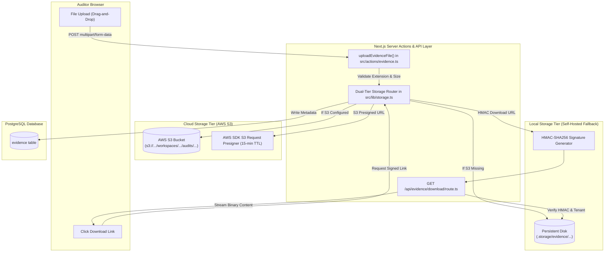

# Section 11: Evidence Vault & Dual Storage Engine

## 1. Evidentiary Architecture & Integrity Model

In regulatory compliance, evidence constitutes the definitive proof that an organizational control is designed and operating effectively. The Audit Platform incorporates a dedicated **Evidence Vault** designed around data integrity, tenant isolation, and zero-trust download security.



---

## 2. Dual-Tier Storage Architecture (`src/lib/storage.ts`)

The platform avoids hard infrastructure vendor lock-in by implementing an automated **Dual-Tier Storage Engine**:

### 2.1 Tier 1: Production AWS S3 Object Storage
- **Activation**: Automatically enabled when `S3_BUCKET`, `S3_ACCESS_KEY_ID`, and `S3_SECRET_ACCESS_KEY` are defined in environment variables.
- **Protocol**: Uses `@aws-sdk/client-s3` and `@aws-sdk/s3-request-presigner`.
- **S3 Compatibility**: Supports AWS S3, Cloudflare R2, MinIO, or LocalStack by specifying `S3_ENDPOINT` and enabling path-style addressing (`forcePathStyle: true`).
- **Pre-Signed URLs**: Binary downloads bypass application servers entirely. The application generates short-lived, pre-signed S3 `GetObject` URLs with a strictly enforced 15-minute Time-To-Live (900 seconds).

### 2.2 Tier 2: Persistent Local Disk Storage (Fallback Mode)
- **Activation**: Activated automatically if S3 credentials are unset, guaranteeing out-of-the-box local development and self-hosted on-premises functionality.
- **Directory Structure**:
  ```
  .storage/evidence/workspaces/[workspace_id]/audits/[audit_id]/[uuid]-[sanitized_name]
  ```
- **Companion Metadata**: Alongside every binary file, a `.meta.json` file is stored recording `contentType`, `size`, and creation timestamp.
- **HMAC-SHA256 Token Protection**: Local files are never served through public static directories. Downloads require an HMAC-SHA256 signed token verified by an application route handler.

---

## 3. Upload Validation & Defense-in-Depth

When a user submits evidence via `uploadEvidenceFile(workspaceId, auditId, formData)`:

1. **Authorization Verification**: Verifies `evidence.create` permission in the targeted workspace.
2. **Audit Verification**: Confirms that `auditId` exists and belongs directly to `workspaceId`.
3. **Empty File Rejection**: Rejects zero-byte files (`file.size === 0`).
4. **File Size Enforcement**: Caps file uploads at **25 MB** ($25 \times 1024 \times 1024$ bytes).
5. **Strict File Extension Whitelist**:
   - Permitted formats: `.pdf`, `.docx`, `.xlsx`, `.csv`, `.png`, `.jpg`, `.jpeg`.
   - Executable, script, or dangerous file types (`.exe`, `.sh`, `.js`, `.html`, `.svg`, `.bat`) are immediately rejected.
6. **Unguessable Storage Key Generation**:
   ```typescript
   export function generateStorageKey(workspaceId: string, auditId: string, filename: string): string {
     const sanitized = filename.replace(/[^a-zA-Z0-9._-]/g, "_");
     const randomBytes = crypto.randomUUID();
     return `workspaces/${workspaceId}/audits/${auditId}/${randomBytes}-${sanitized}`;
   }
   ```
7. **Two-Phase Write Order**:
   - The binary stream is written to object storage **first**.
   - Only upon confirmed storage write is the metadata row inserted into the PostgreSQL `evidence` table.
   - Live audit counters (`audits.evidence`) are incremented automatically.

---

## 4. Evidence Metadata Schema

```sql
CREATE TABLE IF NOT EXISTS evidence (
  id VARCHAR(64) PRIMARY KEY,
  workspace_id VARCHAR(64) NOT NULL,
  audit_id VARCHAR(64) NOT NULL,
  reference VARCHAR(64) NOT NULL,
  name VARCHAR(255) NOT NULL,
  type VARCHAR(64) NOT NULL,
  control VARCHAR(128) NOT NULL,
  uploaded_by VARCHAR(128) NOT NULL,
  date DATE NOT NULL,
  status VARCHAR(32) NOT NULL DEFAULT 'Submitted',
  description TEXT,
  size VARCHAR(32) NOT NULL,
  framework VARCHAR(64) NOT NULL,
  reviewed_by VARCHAR(128) DEFAULT 'Pending Review',
  storage_key TEXT,
  mime_type VARCHAR(128),
  created_at TIMESTAMP WITH TIME ZONE DEFAULT CURRENT_TIMESTAMP,
  updated_at TIMESTAMP WITH TIME ZONE DEFAULT CURRENT_TIMESTAMP,
  FOREIGN KEY (workspace_id) REFERENCES workspaces(id) ON DELETE CASCADE,
  FOREIGN KEY (audit_id) REFERENCES audits(id) ON DELETE CASCADE
);
```

### 4.1 Evidence Lifecycle States
- **Requested**: An auditor has logged a request for policy, screenshot, or configuration files from the client.
- **Submitted**: The operational team has uploaded the artifact.
- **Under Review**: An auditor or reviewer is actively analyzing the evidence against control requirements.
- **Accepted**: The evidence satisfies the control requirement without reservation.
- **Rejected**: The evidence is outdated, incomplete, or illegible, requiring resubmission.

---

## 5. Streaming Download Route Handler (`/api/evidence/download/route.ts`)

For local storage or proxied downloads, the endpoint enforces a dual-authentication mechanism:

```typescript
// Check Method A: Signed HMAC token authorization
if (token && expiresStr && key) {
  const expires = parseInt(expiresStr, 10);
  if (!isNaN(expires) && verifyDownloadToken(token, key, workspaceId, evidenceId, expires)) {
    isAuthorized = true;
  }
}

// Check Method B: Active User Session with RBAC
if (!isAuthorized) {
  const session = await getSession();
  if (session && session.user) {
    await requirePermission("evidence.view", workspaceId);
    isAuthorized = true;
  }
}
```

### 5.1 Defense Against Timing Attacks
When validating download tokens, `timingSafeEqual` is utilized to thwart timing side-channel attacks:
```typescript
return crypto.timingSafeEqual(Buffer.from(token, "hex"), Buffer.from(expected, "hex"));
```
