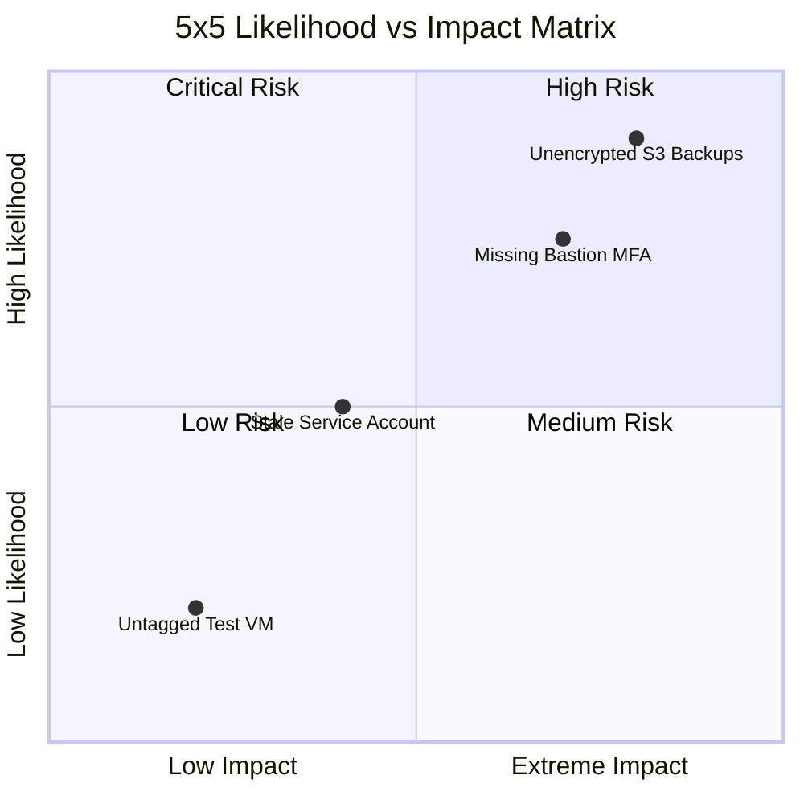

# Section 12: Finding & Remediation Management

## 1. Non-Conformity & Finding Lifecycle

In compliance auditing, a **finding** represents a validated non-conformity, control deficiency, or operational deviation where observed practice fails to satisfy the formal criteria of an adopted standard.

The platform manages findings from initial discovery through corrective action verification and eventual closure:

```mermaid
stateDiagram-v2
    [*] --> Open : Auditor identifies deficiency during fieldwork
    Open --> InProgress : Corrective action owner assigned & remediation begins
    InProgress --> Remediated : Fix deployed & operational evidence submitted
    Remediated --> Closed : Auditor verifies evidentiary proof and formally closes
    Open --> AcceptedRisk : Management formally accepts risk (CISO exception sign-off)
    InProgress --> AcceptedRisk : Management formally accepts residual risk
    AcceptedRisk --> Closed : Documented in enterprise risk register
    Closed --> [*]
```



---

## 2. Severity Classification & Remediation SLAs

Findings are categorized into five severity levels in `src/lib/findings-types.ts`, each mapped to strict remediation Service Level Agreements (SLAs):

| Severity Level | Definition & Operational Impact | Remediation SLA | Example Scenarios |
| :--- | :--- | :---: | :--- |
| **Critical** | Severe control breakdown leading to immediate exploitation, data exfiltration, or complete loss of service. | **48 Hours** | Publicly accessible production database, unauthenticated administrative endpoints, compromised root credentials. |
| **High** | Significant control gap that undermines core defense-in-depth protections. | **14 Days** | Multi-factor authentication disabled on VPNs, unencrypted database backups, unpatched remote code execution vulnerabilities. |
| **Medium** | Notable deviation from best practice; does not provide direct exploit path without chaining. | **30 Days** | Password complexity policy below standard, stale user accounts (>90 days inactive), missing centralized logging on secondary servers. |
| **Low** | Minor procedural omission or documentation gap with low likelihood of exploitation. | **60 Days** | Outdated annual policy review timestamp, incomplete disaster recovery contact list, untagged cloud infrastructure assets. |
| **Informational** | Advisory observation, process optimization, or architectural enhancement opportunity. | **90 Days / Discretionary** | Recommendation to adopt automated IAM entitlement reviews or migrate from static tokens to short-lived STS tokens. |

---

## 3. Finding Relational Data Model (`findings` Table)

```sql
CREATE TABLE IF NOT EXISTS findings (
  id VARCHAR(64) PRIMARY KEY,
  workspace_id VARCHAR(64) NOT NULL,
  audit_id VARCHAR(64) NOT NULL,
  reference VARCHAR(64) NOT NULL,
  title VARCHAR(255) NOT NULL,
  description TEXT NOT NULL,
  framework VARCHAR(64) NOT NULL,
  control VARCHAR(128) NOT NULL,
  severity VARCHAR(32) NOT NULL DEFAULT 'Medium',
  owner VARCHAR(128) NOT NULL DEFAULT 'Unassigned',
  identified_date DATE NOT NULL,
  due_date DATE NOT NULL,
  status VARCHAR(32) NOT NULL DEFAULT 'Open',
  recommendation TEXT,
  evidence TEXT,
  auditor VARCHAR(128) NOT NULL,
  created_at TIMESTAMP WITH TIME ZONE DEFAULT CURRENT_TIMESTAMP,
  updated_at TIMESTAMP WITH TIME ZONE DEFAULT CURRENT_TIMESTAMP,
  FOREIGN KEY (workspace_id) REFERENCES workspaces(id) ON DELETE CASCADE,
  FOREIGN KEY (audit_id) REFERENCES audits(id) ON DELETE CASCADE
);
```

### 3.1 Status Alias Normalization
To guarantee backwards compatibility with legacy client components, `src/actions/findings.ts` normalizes alternate statuses:
- `"Resolved"` $\rightarrow$ `"Remediated"`
- `"Accepted"` $\rightarrow$ `"Accepted Risk"`

---

## 4. Multi-Tenant Cross-Workspace Evidence Safeguards

To prevent horizontal privilege escalation and data leakage, `createFinding` and `updateFinding` strictly validate referenced evidence:

```typescript
if (input.evidence && input.evidence.trim()) {
  const referencedEvidence = await db.queryOne<{ workspace_id: string }>(
    "SELECT workspace_id FROM evidence WHERE id = $1 OR reference = $2",
    [input.evidence.trim(), input.evidence.trim()]
  );

  if (referencedEvidence && referencedEvidence.workspace_id !== workspaceId) {
    return {
      success: false,
      error: "Referenced evidence belongs to another workspace",
    };
  }
}
```

This prevents an attacker in Tenant A from referencing or proving compliance using sensitive evidence files stored in Tenant B.

---

## 5. Enterprise Risk Matrix & Residual Scoring (`src/actions/risks.ts`)

Every finding can be linked to an operational risk in the **$5 \times 5$ Risk Matrix**:



### 5.1 Mathematical Risk Calculation
Risk scores are calculated as the product of Likelihood ($L \in [1..5]$) and Impact ($I \in [1..5]$):

$$\text{Inherent Score } = L \times I \quad (1 \le \text{Score} \le 25)$$

$$\text{Level} = \begin{cases} 
\text{Critical} & \text{if Score} \ge 16 \\ 
\text{High} & \text{if } 10 \le \text{Score} < 16 \\ 
\text{Medium} & \text{if } 5 \le \text{Score} < 10 \\ 
\text{Low} & \text{if Score} < 5 
\end{cases}$$

### 5.2 Qualitative Scoring Factors
- **Likelihood ($L$)**:
  - `Rare` (1): May occur only in exceptional circumstances.
  - `Unlikely` (2): Could occur at some time.
  - `Possible` (3): Might occur at some time.
  - `Likely` (4): Will probably occur in most circumstances.
  - `Almost Certain` (5): Expected to occur in most circumstances.
- **Impact ($I$)**:
  - `Minimal` (1): Negligible financial, reputational, or operational impact.
  - `Minor` (2): Minor disruption handled by routine procedures.
  - `Moderate` (3): Significant disruption requiring management intervention.
  - `Major` (4): Critical systems offline, regulatory inquiry triggered.
  - `Severe / Critical` (5): Catastrophic business failure, severe legal liability.

### 5.3 Risk Treatment Strategies
Organizations apply four formal risk treatment responses:
1. **Mitigate**: Implement technical or operational controls to reduce likelihood or impact (e.g., enable MFA).
2. **Accept**: Management acknowledges and retains the risk without further action, documenting business justification.
3. **Transfer**: Shift risk exposure to a third party (e.g., cyber insurance or managed service agreements).
4. **Avoid**: Eliminate the risk by discontinuing the risky activity (e.g., deprecating an insecure legacy protocol).

Upon treatment implementation, a **Residual Score** and **Residual Level** are recorded, tracking the net exposure remaining after controls are verified.
