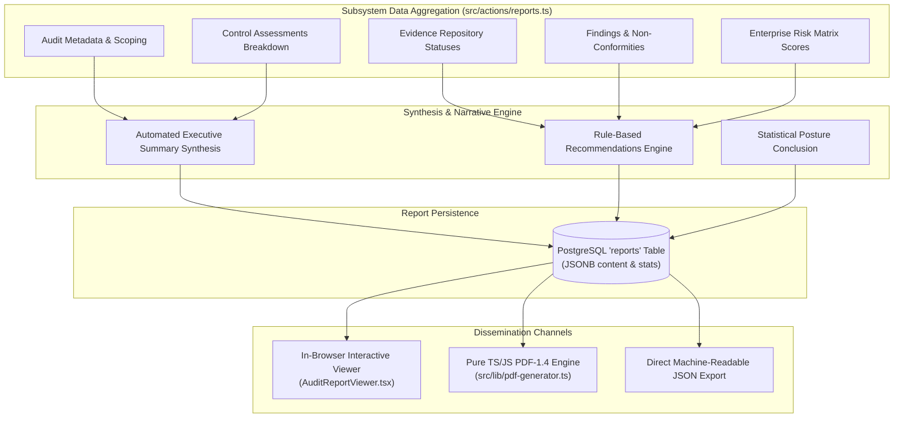

# Section 13: Reporting Engine & Pure PDF-1.4 Generation

## 1. Audit Reporting Engine Overview

A formal compliance report represents the definitive culmination of an audit engagement. The Audit Platform's **Reporting Engine** aggregates data across all audit subsystems—scoping parameters, control assessments, evidentiary files, identified findings, and risk matrix calculations—synthesizing them into an authoritative, 12-section compliance document.

---

## 2. The Twelve Authoritative Report Sections

When `generateReport(workspaceId, auditId, reportType, customName)` is executed, it compiles 12 distinct sections into `ReportContentData`:

| Section # | Section Title | Data Source & Analytical Scope |
| :---: | :--- | :--- |
| **1** | **Executive Summary** | Synthesizes organization name, framework, completion percentage, control implementation counts, findings count, and risk metrics into an executive narrative. |
| **2** | **Audit Details & Scope** | Formal engagement boundaries: Audit ID, Lead Auditor, Start Date, Target Due Date, Objectives, and Technical Scope. |
| **3** | **Compliance Frameworks** | Primary framework (ISO 27001, NIST CSF, NIST SP 800-53, SOC 2) and cross-mapped standards evaluated. |
| **4** | **Control Assessment Breakdown** | Quantitative breakdown across the 6 assessment states (`Implemented`, `Partially Implemented`, `Not Implemented`, `In Progress`, `Not Started`, `Not Applicable`). |
| **5** | **Control Assessment Details** | Comprehensive itemized table detailing Control ID, Title, Domain, Assessor Name, Status, and Field Notes. |
| **6** | **Evidence Summary** | Status breakdown of all uploaded evidentiary artifacts (`Accepted`, `Under Review`, `Submitted`, `Requested`, `Rejected`). |
| **7** | **Evidence Item Registry** | Tabular index of evidence items: Reference ID, File Name, Target Control, and Current Verification State. |
| **8** | **Findings Summary** | Severity distribution table classifying non-conformities (`Critical`, `High`, `Medium`, `Low`, `Informational`). |
| **9** | **Finding Details & Action Plans** | Detailed dossier for each deficiency: Reference, Title, Severity, Responsible Owner, Mapped Control, and Recommendation. |
| **10** | **Risk Assessment & Matrix** | $5 \times 5$ Likelihood vs Impact classification, inherent risk scores, treatment choices (`Mitigate`, `Accept`, `Transfer`, `Avoid`), and residual risk scores. |
| **11** | **Prioritized Recommendations** | Automated, rule-driven actionable recommendations generated based on observed severity counts and unimplemented controls. |
| **12** | **Conclusion & Sign-Off** | Mathematical compliance index ($\%$) statement, period of evaluation, formal closing statement, and timestamped digital signature block. |

---

## 3. Pure TypeScript / JavaScript PDF-1.4 Generation Engine

Most Node.js reporting systems rely on Puppeteer or headless Chromium, which introduces massive binary dependencies (300MB+), high memory overhead, cold-start latency, and frequent crashes in serverless execution environments (Vercel Serverless Functions, AWS Lambda).

The Audit Platform uses **`src/lib/pdf-generator.ts`**, a custom, zero-dependency, pure TypeScript PDF compiler that directly builds binary-compliant **PDF-1.4 documents in memory**.

### 3.1 Architectural Advantages
- **Zero External Binaries**: Operates purely within standard Vercel serverless memory limits without downloading Chromium.
- **Microsecond Latency**: Compiles a multi-page audit report with custom styling, decorative bars, tabular data, and typography in **under 150 milliseconds**.
- **Deterministic Layout Engine**: Calculates page heights, line wraps, margins, and automatic page breaks mathematically based on typography metrics.

### 3.2 Low-Level PDF-1.4 Stream Assembly
The generator constructs standard PDF specification objects:
1. **Catalog Object (`/Catalog`)**: Root document dictionary pointing to the Pages tree.
2. **Pages Dictionary (`/Pages`)**: Hierarchical tree tracking page dimensions (Letter size: $612 \times 792$ points; 1 inch = 72 pt).
3. **Font Dictionaries (`/Font`)**: Standard PDF Type 1 typography (`/Helvetica` as `/F1`, `/Helvetica-Bold` as `/F2`).
4. **Content Streams (`/Length`, `stream ... endstream`)**: Emits low-level PostScript-style PDF drawing and text positioning operators:
   - `BT ... ET`: Begin and end text blocks.
   - `Tf`: Font and font size selection.
   - `Td`: Translation / coordinate placement ($x, y$).
   - `Tj`: Text rendering string with parenthesis escaping.
   - `rg` / `re` / `f`: RGB color selection, rectangle definition, and fill operators.
5. **Cross-Reference Table (`xref`)**: Byte-exact byte offsets for every PDF object.
6. **Trailer & EOF**: Trailer dictionary pointing to the root catalog and `startxref` offset.

---

## 4. In-Browser Interactive Viewer (`AuditReportViewer.tsx`)

Users inspect reports directly in the browser before exporting:
- **Responsive Navigation**: Collapsible side-index jumping to any of the 12 report sections.
- **Metric Cards**: Executive badges indicating compliance percentage, open findings, and evidence verification counts.
- **Print Optimization**: Includes tailored CSS `@media print` stylesheets enabling clean browser printing directly to hardware printers or local PDF saves.
- **Dual Export Buttons**:
  - *Download PDF*: Calls `generatePdf14(report)` on the server and streams the compiled binary attachment.
  - *Export JSON*: Downloads the raw structured data payload for SIEM, GRC data lakes, or automated ingestion pipelines.
