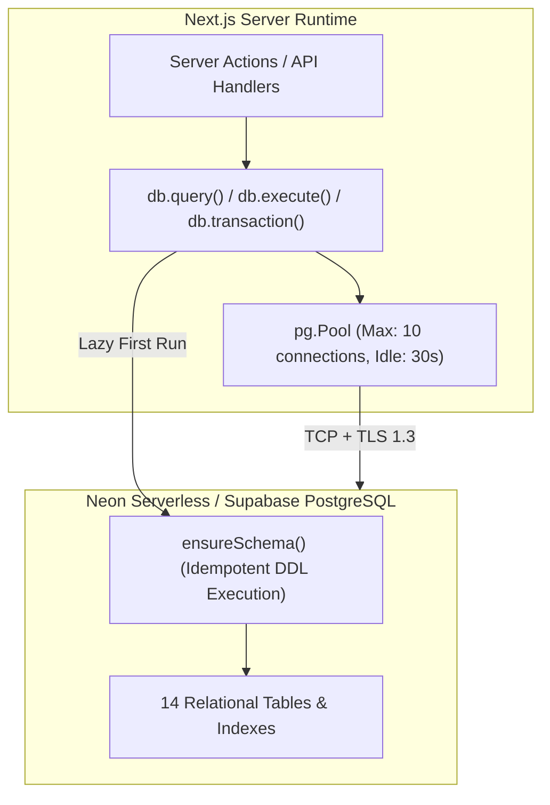
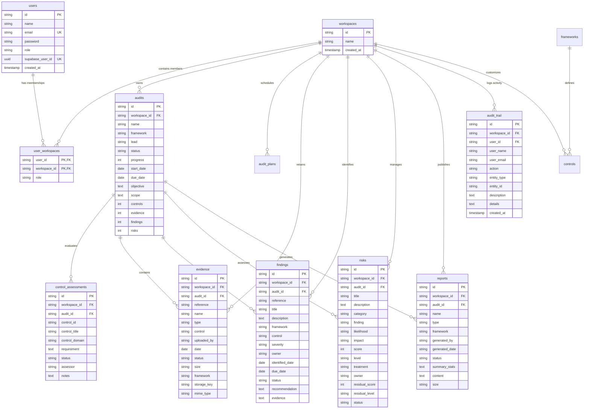

# Section 14: Relational Data Model & PostgreSQL Schema

## 1. Database Architecture & Connection Pooling

The Audit Platform utilizes **PostgreSQL** (hosted on Neon Serverless Postgres or Supabase Database) as its relational storage engine. Database communication is managed in `src/lib/db.ts` using the native Node.js `pg` driver (`pg.Pool`).



### 1.1 Connection Pool Settings
- **Max Connections**: 10 concurrent pooled connections (`max: 10`).
- **Idle Timeout**: 30,000 milliseconds (`idleTimeoutMillis: 30000`).
- **Connection Timeout**: 10,000 milliseconds (`connectionTimeoutMillis: 10000`).
- **SSL Configuration**: Automatically rejects unauthorized certificates on local connections, while enabling SSL for remote providers (`neon.tech`, `supabase`, or `NODE_ENV === 'production'`).

---

## 2. Entity-Relationship Diagram (ERD)



---

## 3. Detailed Table Dictionary

### 3.1 Core Authentication & Tenancy

#### `users`
Stores application user identity, synced with Supabase Auth:
- `id` (TEXT, PK): Internal application UUID.
- `name` (TEXT): Auditor/user full name.
- `email` (TEXT, UNIQUE): Lowercased user email.
- `role` (TEXT): Default system role (`Viewer`).
- `supabase_user_id` (UUID, UNIQUE): Foreign key pointer to `auth.users.id` in Supabase.
- `created_at` (TIMESTAMPTZ): Registration timestamp.

#### `user_workspaces`
Pivot table mapping users to organizational tenants and role scopes:
- `user_id` (TEXT, PK, FK $\rightarrow$ `users.id` ON DELETE CASCADE).
- `workspace_id` (TEXT, PK, FK $\rightarrow$ `workspaces.id` ON DELETE CASCADE).
- `role` (TEXT): Active tenant role (`Owner`, `Admin`, `Auditor`, `Reviewer`, `Viewer`).

#### `workspaces`
Defines isolated customer organizations:
- `id` (TEXT, PK): Workspace UUID.
- `name` (TEXT): Organization or legal entity name.
- `created_at` (TIMESTAMPTZ).

---

### 3.2 Audit Lifecycle & Fieldwork

#### `audits`
The central root entity for all testing engagements:
- `id` (TEXT, PK): Format `AUD-YYYY-XXXXX`.
- `workspace_id` (TEXT, FK $\rightarrow$ `workspaces.id` ON DELETE CASCADE).
- `name` (TEXT): Audit title.
- `framework` (TEXT): Primary standard (`ISO 27001`, `NIST CSF`, `SOC 2`, `NIST SP 800-53`).
- `lead` (TEXT): Lead auditor name.
- `status` (TEXT): Lifecycle status (`Planning`, `Fieldwork`, `Review`, `Reporting`, `Completed`).
- `progress` (INTEGER): Calculated completion index ($0..100\%$).
- `start_date` / `due_date` (TEXT): Period of assessment.
- `objective` / `scope` (TEXT): Engagement scope boundaries.
- `controls`, `evidence`, `findings`, `risks` (INTEGER): Cached entity counts.

#### `control_assessments`
Granular evaluations of individual standard controls within an audit:
- `id` (TEXT, PK): `ASM-XXXXXXXX`.
- `workspace_id` (TEXT, FK $\rightarrow$ `workspaces.id` ON DELETE CASCADE).
- `audit_id` (TEXT, FK $\rightarrow$ `audits.id` ON DELETE CASCADE).
- `control_id` (TEXT): Standard control reference (e.g., `A.5.15`).
- `control_title` / `control_domain` (TEXT): Control name and functional category.
- `requirement` (TEXT): Specific compliance criteria.
- `status` (TEXT): Evaluation state (`Not Started`, `In Progress`, `Implemented`, `Partially Implemented`, `Not Implemented`, `Not Applicable`).
- `assessor` (TEXT): Assigned field testing auditor.
- `notes` (TEXT): Testing observations and auditor commentary.

---

### 3.3 Evidentiary Vault, Findings & Risk

#### `evidence`
Physical files uploaded to prove control effectiveness:
- `id` (TEXT, PK): `EVD-YYYY-XXXXX`.
- `workspace_id` (TEXT, FK $\rightarrow$ `workspaces.id` ON DELETE CASCADE).
- `audit_id` (TEXT, FK $\rightarrow$ `audits.id` ON DELETE CASCADE).
- `reference` (TEXT): `EV-XXXX`.
- `name` (TEXT): Original file name.
- `type` (TEXT): Extension type (`PDF`, `PNG`, `XLSX`).
- `control` (TEXT): Target control reference.
- `status` (TEXT): `Requested`, `Submitted`, `Under Review`, `Accepted`, `Rejected`.
- `storage_key` (TEXT): Path in S3 or local `.storage` disk.
- `mime_type` (TEXT): Verified MIME content-type.

#### `findings`
Documented compliance non-conformities:
- `id` (TEXT, PK): Finding UUID.
- `workspace_id` (TEXT, FK $\rightarrow$ `workspaces.id` ON DELETE CASCADE).
- `audit_id` (TEXT, FK $\rightarrow$ `audits.id` ON DELETE CASCADE).
- `reference` (TEXT): `FND-YYYY-XXXXX`.
- `title` / `description` (TEXT): Detailed defect description.
- `severity` (TEXT): `Critical`, `High`, `Medium`, `Low`, `Informational`.
- `status` (TEXT): `Open`, `In Progress`, `Remediated`, `Accepted Risk`, `Closed`.
- `recommendation` (TEXT): Actionable remediation instructions.
- `evidence` (TEXT): Associated evidence reference.

#### `risks`
Quantified enterprise operational risks:
- `id` (TEXT, PK): Risk UUID.
- `workspace_id` / `audit_id` (TEXT, FKs).
- `likelihood` / `impact` (TEXT): $1..5$ qualitative ratings.
- `score` (INTEGER): Calculated product ($1..25$).
- `level` (TEXT): `Critical`, `High`, `Medium`, `Low`.
- `treatment` (TEXT): `Mitigate`, `Accept`, `Transfer`, `Avoid`.
- `residual_score` (INTEGER): Post-treatment calculated risk.

---

### 3.4 Governance, Reporting & Audit Trails

#### `reports`
Immutable snapshots of compiled audit deliverables:
- `id` (TEXT, PK): `RPT-XXXXXXXX`.
- `workspace_id` / `audit_id` (TEXT, FKs).
- `summary_stats` (TEXT): JSON stringified executive metrics.
- `content` (TEXT): JSON stringified 12-section audit dossier.

#### `audit_trail`
Append-only tamper-evident event log:
- `id` (TEXT, PK): Log event UUID.
- `workspace_id` / `user_id` (TEXT, FKs).
- `action` (TEXT): `CREATE`, `UPDATE`, `DELETE`, `STATUS_CHANGE`.
- `entity_type` (TEXT): Target entity (`Audit`, `Evidence`, `Finding`, `Member`, `Report`).
- `description` (TEXT): Human-readable activity narrative.
- `details` (TEXT): Structured JSON payload of mutation diff.

---

## 4. Performance Indexes & Query Optimization

To maintain sub-50ms query response times under high data volumes, the following indexes are maintained in `src/lib/db.ts`:

```sql
CREATE INDEX IF NOT EXISTS idx_users_supabase_user_id ON users(supabase_user_id);
CREATE INDEX IF NOT EXISTS idx_password_resets_email ON password_resets(email);
CREATE INDEX IF NOT EXISTS idx_audits_workspace ON audits(workspace_id);
CREATE INDEX IF NOT EXISTS idx_findings_workspace ON findings(workspace_id);
CREATE INDEX IF NOT EXISTS idx_findings_audit ON findings(audit_id);
CREATE INDEX IF NOT EXISTS idx_risks_workspace ON risks(workspace_id);
CREATE INDEX IF NOT EXISTS idx_risks_audit ON risks(audit_id);
CREATE INDEX IF NOT EXISTS idx_evidence_workspace ON evidence(workspace_id);
CREATE INDEX IF NOT EXISTS idx_evidence_audit ON evidence(audit_id);
CREATE INDEX IF NOT EXISTS idx_audit_trail_workspace ON audit_trail(workspace_id);
CREATE INDEX IF NOT EXISTS idx_audit_trail_created_at ON audit_trail(created_at);
CREATE INDEX IF NOT EXISTS idx_audit_trail_entity ON audit_trail(entity_type, entity_id);
```
