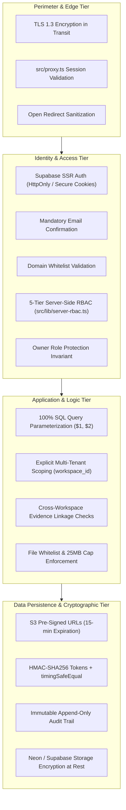

# Section 15: Security Architecture & Threat Modeling

## 1. Security Philosophy & Defense-in-Depth

The Audit Platform manages highly sensitive governance records, regulatory compliance gap assessments, and proprietary organizational evidence files. Consequently, security is engineered into every tier following the **Defense-in-Depth** and **Principle of Least Privilege** paradigms.



---

## 2. Implemented Security Controls

### 2.1 Complete SQL Injection Elimination
- **Mechanism**: Every database interaction across all Server Actions utilizes parameterized queries through Node.js `pg.Pool` (`$1`, `$2`, ...).
- **Verification**: Zero instances of raw string concatenation or template literal interpolation (`${var}`) are permitted in SQL execution statements.

### 2.2 Server-Side RBAC & Privilege Escalation Prevention
- **Enforcement Location**: All authorization checks execute server-side in `src/lib/server-rbac.ts` via `requirePermission(perm, workspaceId)`. Client-side checks are strictly cosmetic.
- **Tenant Scope Binding**: Permissions are validated against the authoritative database record in `user_workspaces` for the active `workspaceId`.
- **Owner Protection Invariant**: `requireRoleManagement` blocks non-Owner administrators from promoting accounts to `Owner` or downgrading existing Owners.

### 2.3 Strict Evidence Vault Protection
- **Extension Whitelist**: Enforces strict verification against an approved list: `.pdf`, `.docx`, `.xlsx`, `.csv`, `.png`, `.jpg`, `.jpeg`.
- **Size Limitation**: Capped at 25 MB ($26,214,400$ bytes) with zero-byte rejection.
- **Cryptographic Key Randomization**: Stored files use `workspaces/${workspaceId}/audits/${auditId}/${crypto.randomUUID()}-${sanitizedName}`, eliminating directory traversal and file enumeration.
- **Time-Limited Access**: Download URLs expire after 15 minutes (900s). For local disk mode, URLs require HMAC-SHA256 signatures validated via `crypto.timingSafeEqual`.

### 2.4 Open Redirect Sanitization
In `/app/auth/callback/route.ts`, post-login redirect paths are strictly filtered:
```typescript
let safeNext = '/workspaces';
if (next && next.startsWith('/') && !next.startsWith('//') && !next.startsWith('/\\')) {
  safeNext = next;
}
```
This guarantees that an attacker cannot abuse query parameters like `?next=https://evil.com` to phish users after authentication.

### 2.5 Multi-Tenant Cross-Workspace Protection
When linking evidence to an audit finding, `src/actions/findings.ts` inspects the evidence record's `workspace_id`. If it does not match the active audit's workspace, the mutation is aborted, preventing unauthorized cross-tenant referencing.

---

## 3. Threat Model (STRIDE Evaluation)

| Threat (STRIDE) | Risk Description | Applied Technical Mitigation | Residual Risk |
| :--- | :--- | :--- | :---: |
| **Spoofing** | Attacker impersonates an authorized auditor or administrator. | Supabase SSR session token verification, mandatory email confirmation, bcrypt password hashing. | Low |
| **Tampering** | Malicious alteration of findings, risk scores, or audit logs. | Server-side RBAC enforcement, parameterized SQL, append-only `audit_trail` table. | Low |
| **Repudiation** | User denies performing an unauthorized modification or deletion. | `audit_trail` logging capturing user ID, name, email, action, entity, timestamp, and JSON diffs. | Low |
| **Information Disclosure** | Unauthorized tenant reads another organization's compliance reports. | Logical tenant isolation requiring `workspace_id = $x` on all SELECT queries; unguessable UUIDs. | Low |
| **Denial of Service** | Resource exhaustion via massive file uploads or DB connection saturation. | 25MB file size limit, Node.js connection pool caps (`max: 10`, 30s idle timeout), pure JS PDF compilation. | Medium |
| **Elevation of Privilege** | An Auditor elevates their role to Administrator or Owner. | Hardcoded permission matrix in `rbac.ts`, `requireRoleManagement` guard checking caller role. | Low |

---

## 4. Recommended Security Enhancements (Future Roadmap)

While the platform implements enterprise-grade application security, the following hardening measures are recommended for high-assurance or defense-grade environments:

1. **Content-Security-Policy (CSP) Directives**:
   - Introduce strict CSP headers via Next.js middleware to restrict script execution, object embedding, and external style injections.
2. **Asynchronous Antivirus Scanning**:
   - Integrate an asynchronous ClamAV daemon or AWS GuardDuty malware scanning pipeline to scan binary evidence streams before marking them as `Submitted`.
3. **Database-Level Row-Level Security (RLS)**:
   - While application queries strictly filter by `workspace_id`, enabling PostgreSQL native Row-Level Security (RLS) with Supabase session claims provides defense-in-depth against potential application logic bugs.
4. **Rate Limiting & Brute-Force Throttling**:
   - Deploy Upstash Redis rate limiters on sensitive mutation endpoints (`/signin`, `uploadEvidenceFile`, and report generation) to throttle denial-of-service attempts.
5. **Hardware Multi-Factor Authentication (WebAuthn / FIDO2)**:
   - Expand Supabase Auth policies to mandate hardware security keys (YubiKey) or TOTP authenticators for users holding `Admin` and `Owner` roles.
