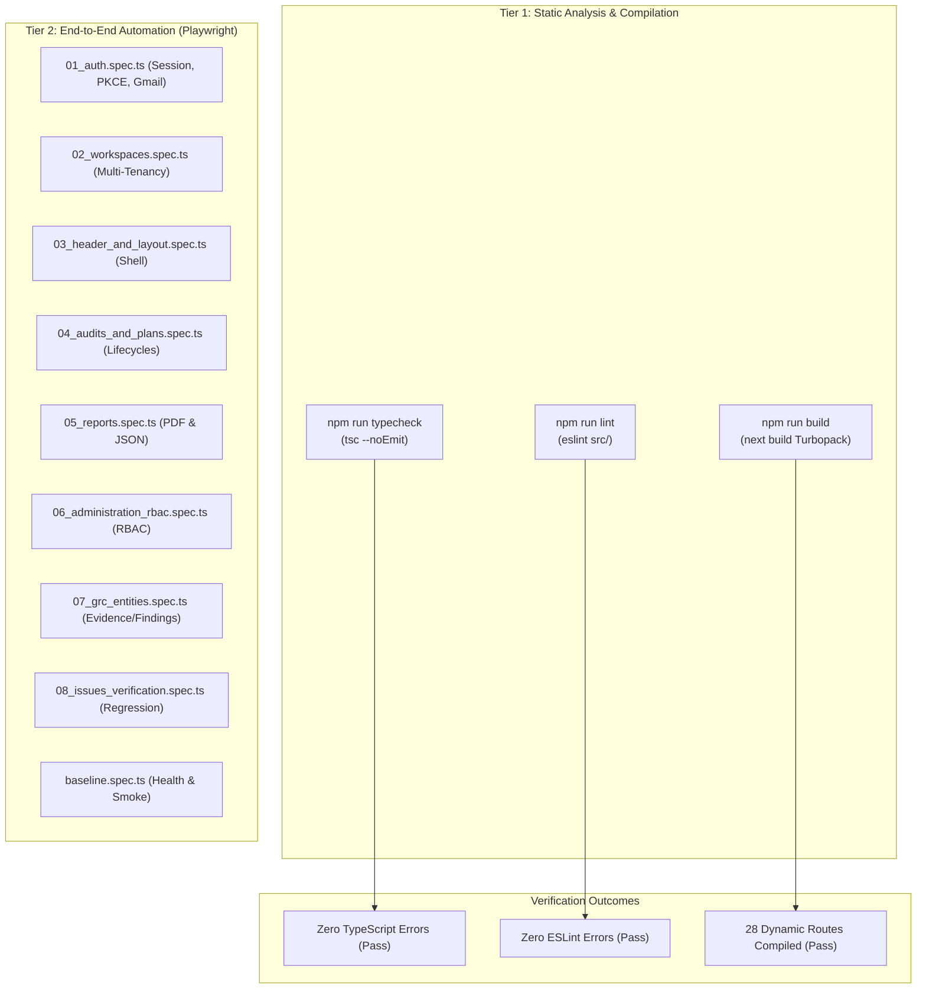

# Section 16: Verification & Automated Testing Suite

## 1. Quality Assurance Strategy & Test Topology

The Audit Platform employs a multi-tiered verification strategy spanning TypeScript strict static typing, ESLint code quality checks, Next.js build graph validation, and End-to-End (E2E) browser automation using the **Playwright** framework.



---

## 2. Static Analysis & Build Verification Results

The test suite and build pipeline have been verified against the codebase:

### 2.1 TypeScript Strict Mode (`npm run typecheck`)
- **Execution Command**: `tsc --noEmit`
- **Result**: **Passed with Exit Code 0**
- **Analysis**: All 28 Next.js App Router dynamic page modules, 13 Server Actions, and supporting database pool clients conform strictly to TypeScript type boundaries with zero compile errors.

### 2.2 ESLint Code Standards (`npm run lint`)
- **Execution Command**: `eslint src/`
- **Result**: **Passed with Exit Code 0** (0 Errors, 54 non-blocking style/unused variable warnings).
- **Analysis**: Flat config rules enforced via `eslint.config.mjs` verifying React 19 hook dependency arrays, Next.js image usage, and ES2022 syntax.

### 2.3 Turbopack Production Build (`npm run build`)
- **Execution Command**: `next build`
- **Result**: **Passed with Exit Code 0**
- **Output Metrics**:
  - Total Build Duration: **15.3 seconds**
  - Compiled Routes: **28 dynamic server routes** (`ƒ /administration`, `ƒ /audits/[id]`, `ƒ /reports`, etc.)
  - Static Assets: Optimized chunks emitted to `.next/static/`
  - Server External Packages: `bcryptjs`, `pg`, `@aws-sdk/client-s3`, `@aws-sdk/s3-request-presigner` preserved outside Turbopack browser client bundles.

---

## 3. Playwright E2E Test Suite Matrix

Browser automation test specs reside in `/tests` and are configured via `playwright.config.ts`:

| Test Specification | Functional Scope | Key Test Cases & Assertions |
| :--- | :--- | :--- |
| `01_auth.spec.ts` | Authentication & Registration | Enforces Gmail regex rejection on non-Gmail signups; tests valid credential signin; asserts error banner on invalid passwords; tests forgot password modal. |
| `02_workspaces.spec.ts` | Multi-Tenant Workspaces | Validates workspace switcher; creates new tenant organization; asserts tenant context switching and `localStorage` persistence. |
| `03_header_and_layout.spec.ts` | App Shell & Global Search | Tests top navbar, sidebar collapsing, global search indexing, and real-time notification popovers. |
| `04_audits_and_plans.spec.ts` | Audit & Plan Lifecycle | Creates audit (`AUD-YYYY-XXXXX`); transitions through Planning $\rightarrow$ Fieldwork $\rightarrow$ Review; creates strategic audit plan; tests progress formula recalculation. |
| `05_reports.spec.ts` | Report Compilation & PDF | Triggers `generateReport`; verifies 12 sections in `AuditReportViewer.tsx`; tests pure PDF-1.4 binary download and JSON export. |
| `06_administration_rbac.spec.ts` | Administration & RBAC | Invites team members; modifies roles; asserts Owner protection invariant (Admin cannot promote to Owner or delete Owner). |
| `07_grc_entities.spec.ts` | Evidence & Findings | Uploads binary evidence file; asserts 25MB cap and extension whitelist; creates finding; tests $5 \times 5$ risk matrix scoring. |
| `08_issues_verification.spec.ts` | Defect Regression Testing | Validates fix for Supabase email confirmation redirect; verifies cross-workspace evidence link rejection. |
| `baseline.spec.ts` | Smoke Testing | Asserts landing page loads; verifies edge proxy redirection from `/` to `/signin` for unauthenticated visitors. |

---

## 4. Test Suite Technical Debt & Locator Drift Analysis

> [!WARNING]
> **LOCATOR DRIFT IDENTIFIED IN `tests/01_auth.spec.ts`**
>
> During reverse-engineering of the authentication UI, a minor test selector drift was identified:
>
> - **In `tests/01_auth.spec.ts` (Line 60)**:
>   ```typescript
>   await page.click('button:has-text("Request Reset Code")');
>   ```
> - **In Active Production Code (`src/app/signin/page.tsx`, Line 419)**:
>   ```tsx
>   <button type="submit" disabled={resetLoading} ...>
>     {resetLoading ? "Sending Link..." : "Send Reset Link"}
>   </button>
>   ```
>
> **Root Cause**: The application was upgraded from an alphanumeric OTP code flow to a secure, time-limited magic reset link flow (`Send Reset Link`). While the application logic was correctly updated, the Playwright E2E test locator was not updated to reflect the new button label.
>
> **Recommended Resolution**: Update the selector in `tests/01_auth.spec.ts` to `button:has-text("Send Reset Link")` or utilize the stable data test ID `[data-testid="forgot-password-submit"]`.

---

## 5. Automated Test Execution Commands

To execute the test suites locally or in CI/CD pipelines:

```bash
# 1. Execute static type checking
npm run typecheck

# 2. Run linting inspection
npm run lint

# 3. Compile full production Next.js build
npm run build

# 4. Launch Playwright E2E browser tests (headed mode)
npx playwright test --headed

# 5. Launch Playwright E2E tests in headless mode across Chromium
npx playwright test tests/01_auth.spec.ts --project=chromium
```
