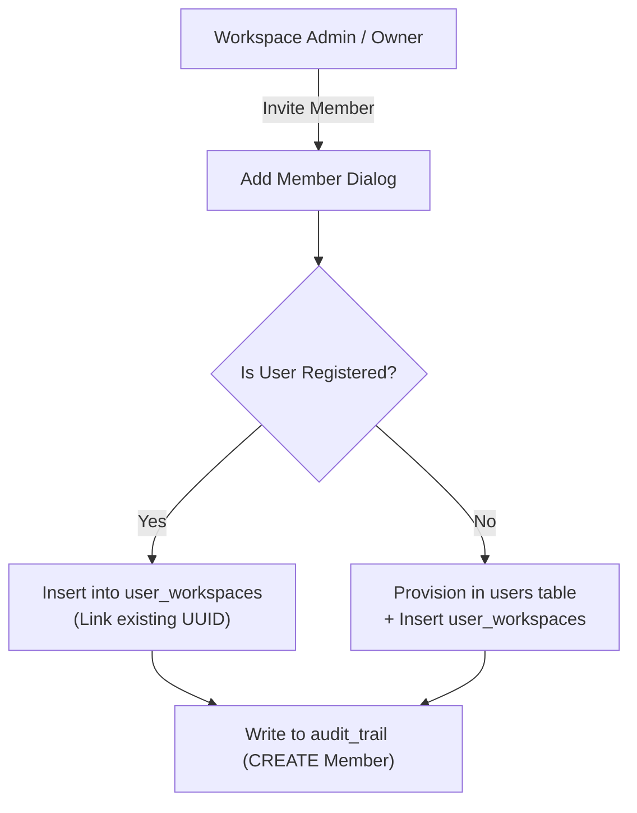

# Section 19: Administrator Operations & Governance Guide

## 1. Administrative Scope & Responsibilities

Administrators and Workspace Owners carry responsibility for managing tenant boundaries, inviting team members, assigning appropriate Role-Based Access Control (RBAC) tiers, overseeing global framework libraries, and reviewing immutable audit logs to ensure organizational compliance.

---

## 2. Workspace Member Management (`/administration`)

Tenant team configuration is performed in the **Administration** module:



### 2.1 Inviting Registered Users (`addWorkspaceMember`)
1. In `/administration`, click **+ Add Member**.
2. Enter the user's registered email address.
3. Select their assigned role: `Admin`, `Auditor`, `Reviewer`, or `Viewer` (Only Owners can assign the `Owner` role).
4. Click **Add Member**. The system links their account to the workspace immediately.

### 2.2 Direct Account Provisioning (`createUserWithWorkspaceMember`)
If the team member has not yet created an account:
1. In the Add Member dialog, supply their Full Name, Email, and temporary password.
2. Select their role.
3. The platform creates the base user account with encrypted credentials (`bcrypt.hash`) and associates them directly with the workspace.

### 2.3 Updating Member Roles (`updateWorkspaceMember`)
1. In the team table, locate the member.
2. Select a new role from the dropdown selector.
3. The system enforces the **Owner Protection Invariant**:
   - An Admin cannot modify the role of an Owner.
   - An Admin cannot promote any user to Owner.
   - Users cannot modify their own active role (prevents self-lockout).
4. The role change is committed and logged as a `STATUS_CHANGE Member` event.

### 2.4 Removing Members (`removeWorkspaceMember`)
1. Click the **Remove** button adjacent to the member row.
2. Confirm the action in the prompt.
3. The user's membership row in `user_workspaces` is deleted. The user loses all access to this organization's audits, evidence, and reports, but their account remains intact in any other assigned workspaces.

---

## 3. The Owner Protection Invariant

To prevent hostile takeovers and administrative privilege escalation within organizations:

> [!IMPORTANT]
> **GOVERNANCE INVARIANT: OWNER PRIVILEGE PROTECTION**
>
> In `src/lib/server-rbac.ts`, the function `requireRoleManagement` strictly separates `Owner` authority from `Admin` authority:
>
> ```typescript
> export async function requireRoleManagement(targetRole: Role, workspaceId: string) {
>   const auth = await requirePermission("roles.manage", workspaceId);
>   
>   // Owner Protection: Only Owners can grant or modify Owner status
>   if (targetRole === "Owner" && auth.role !== "Owner") {
>     throw new AuthorizationError("Forbidden: Only Owners can manage Owner roles");
>   }
>   
>   return auth;
> }
> ```
>
> An `Admin` can manage all standard operational roles (`Auditor`, `Reviewer`, `Viewer`) but cannot alter an existing Owner's role, delete an Owner from the workspace, or elevate themselves or others to Owner status.

---

## 4. Inspecting the Workspace Audit Trail (`/audit-trail`)

The Audit Platform maintains a legally defensible, append-only activity log in the `audit_trail` table. Administrators use `/audit-trail` to monitor operational accountability:

### 4.1 Filter Capabilities
- **Date Range**: Filter events by specific calendar windows.
- **Entity Type**: Filter by target subsystem (`Audit`, `Evidence`, `Finding`, `Member`, `Report`, `Workspace`).
- **Action Type**: Filter by operation (`CREATE`, `UPDATE`, `DELETE`, `STATUS_CHANGE`).
- **Search Query**: Keyword search across user names, email addresses, and event descriptions.

### 4.2 Record Schema Inspection
Each audit log entry captures:
- **Timestamp**: High-precision UTC timestamp.
- **Actor Identity**: User ID, Full Name, and verified Email address.
- **Action & Entity**: e.g., `STATUS_CHANGE Finding` or `CREATE Evidence`.
- **Narrative Description**: e.g., `Changed audit "Q1 2026 ISO 27001" status from Planning to Fieldwork`.
- **Structured Details**: JSON diff capturing pre- and post-mutation field values.

---

## 5. Global Framework & Control Library Maintenance (`/frameworks`, `/control-library`)

1. **Viewing Baseline Standards**: Administrators can inspect pre-seeded controls for ISO/IEC 27001:2022, NIST CSF 2.0, NIST SP 800-53 Rev. 5, and SOC 2 Type II.
2. **Adding Custom Controls**: Organizations with proprietary internal security policies can add custom controls via `createControl`. Setting `workspace_id = [current_workspace_id]` ensures that custom controls remain private to the organization.
3. **Cross-Framework Mapping**: Administrators can update mapped standards (`mapped_frameworks: string[]`) to ensure single-testing efficiency across overlapping compliance regimes.
