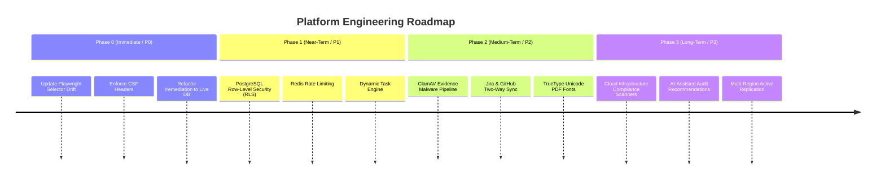

# Section 22: Technical Roadmap & Future Evolution

## 1. Roadmap Strategy & Prioritization Matrix

The platform roadmap is prioritized into four chronological tiers balancing immediate stability, enterprise hardening, and ecosystem integration:

---

## 2. Phase 0: Immediate Hardening & Quality (P0 - Next Sprint)

- **P0.1: Playwright Auth Test Selector Alignment**:
  - Update `tests/01_auth.spec.ts` line 60 from `"Request Reset Code"` to `"Send Reset Link"` to match the modernized magic reset link UI, ensuring clean automated regression passes.
- **P0.2: Content-Security-Policy (CSP) Directives**:
  - Implement strict CSP headers in `next.config.ts` blocking inline script execution and unapproved frame embedding.
- **P0.3: Transitional Route Database Binding**:
  - Refactor `/remediation` and `/tasks` pages from client-side state to live Server Actions querying PostgreSQL `findings` and `user_workspaces`.

---

## 3. Phase 1: Near-Term Security & Architecture (P1 - 1 to 3 Months)

- **P1.1: Database-Level Row-Level Security (RLS)**:
  - Configure PostgreSQL native RLS policies matching Supabase JWT claims as defense-in-depth behind application-level query scoping.
- **P1.2: Distributed Rate Limiting via Redis**:
  - Deploy Upstash Redis rate limiters on `/signin`, `uploadEvidenceFile`, and report generation actions to protect against brute-force and resource exhaustion attacks.
- **P1.3: Native Webhook Event Pipeline**:
  - Enable outbound webhooks allowing enterprise subscribers to receive real-time HTTP POST notifications when findings are created or audit milestones are updated.

---

## 4. Phase 2: Medium-Term Ecosystem Integrations (P2 - 3 to 6 Months)

- **P2.1: Asynchronous Binary Malware Scanning**:
  - Pipe incoming evidence streams to an asynchronous ClamAV daemon or AWS GuardDuty agent prior to promoting file status to `Submitted`.
- **P2.2: Two-Way Jira & GitHub Issues Integration**:
  - Synchronize audit findings bi-directionally with engineering ticketing systems (Jira, GitHub Issues, GitLab). Closing an issue in Jira automatically updates the finding status to `Remediated` in the audit.
- **P2.3: TrueType Font Embedding in PDF Generator**:
  - Extend `src/lib/pdf-generator.ts` with TrueType/OpenType font table parsing to support global multilingual reports (Arabic, CJK, Devanagari).

---

## 5. Phase 3: Long-Term Enterprise & AI Evolution (P3 - 6 to 12 Months)

- **P3.1: Automated Cloud Infrastructure Scanners**:
  - Direct read-only connectors for AWS CloudTrail/Config and Google Cloud Security Command Center to automatically ingest evidence and evaluate controls continuously.
- **P3.2: AI-Assisted Remediation Copilot**:
  - Leverage the Google Gemini API to analyze identified non-conformities and automatically suggest actionable remediation plans and policy draft templates.
- **P3.3: Multi-Region Active-Active Storage Replication**:
  - Configure multi-region S3 bucket replication and global database read replicas to guarantee compliance availability across international jurisdictions.
