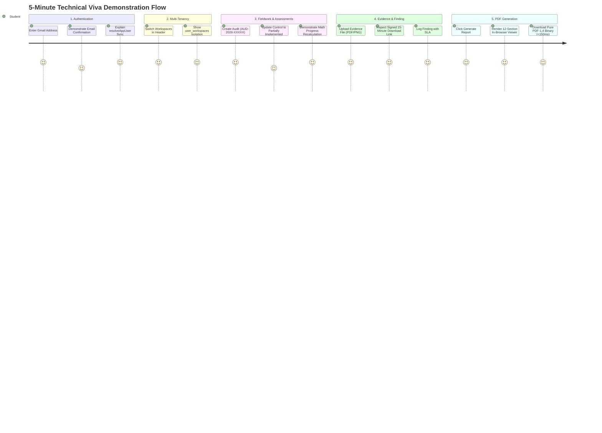

# Section 24: Viva Voce & Technical Defense Guide

## 1. Demonstration Scripts

### 1.1 The 30-Second Elevator Pitch
> *"The Audit Platform is a modern, multi-tenant Governance, Risk, and Compliance (GRC) management system built on Next.js 16, React 19, TypeScript, and PostgreSQL. It replaces fragile compliance spreadsheets with a deterministic 5-stage audit lifecycle, a dual-tier evidentiary vault supporting AWS S3 and local signed storage, an enterprise 5x5 risk matrix, and a pure TypeScript PDF-1.4 compiler that synthesizes complete 12-section compliance audit reports in under 150 milliseconds without headless browser dependencies."*

---

### 1.2 The 1-Minute Technical Summary
> *"Enterprise compliance auditing across standards like ISO 27001, NIST CSF, and SOC 2 suffers from fragmented recordkeeping, lack of evidentiary audit trails, and heavy infrastructure bloat. Our platform solves this by providing a unified, secure system of record. We implement a hybrid identity architecture pairing Supabase SSR authentication with an internal PostgreSQL user and tenant store. Every mutation is guarded by a 5-tier server-side RBAC engine enforcing an Owner protection invariant. The platform features an automated assessment progress engine, cross-workspace evidence leakage prevention, and an in-memory PDF generator built from scratch to eliminate the 300MB container overhead of Puppeteer. The entire platform is deployed live on Vercel and Neon Serverless Postgres, with zero TypeScript errors and an automated Playwright regression suite."*

---

### 1.3 The 5-Minute Comprehensive Demonstration Script

1. **Step 1: Sign-In & Tenancy (1 min)**:
   - Navigate to `/signin`. Point out domain validation enforcing `@gmail.com` to prevent spam accounts.
   - Sign in as an authorized Workspace Owner (`alice.owner@example.com`).
   - Open `/workspaces`. Demonstrate tenant selection and explain how `WorkspaceContext` persists active state in `localStorage`.
2. **Step 2: Audit Initiation & Scoping (1 min)**:
   - Navigate to `/audits` and click **+ New Audit**.
   - Select **ISO 27001:2022**, name the audit, and set start and due dates.
   - Open the created audit. Show that baseline controls (Annex A) are automatically provisioned into `control_assessments` via `initializeAuditAssessments`.
3. **Step 3: Field Testing & Progress Formula (1 min)**:
   - Mark a control as `Implemented` (contributes 100%) and another as `Partially Implemented` (contributes 50%).
   - Show the dynamic progress gauge update in real time. Explain the mathematical formula:
     $$\text{Progress} = \operatorname{round}\left(\frac{N_{\text{Impl}} + N_{\text{NA}} + 0.5 \times N_{\text{Partial}}}{\text{Total Controls}} \times 100\right)$$
4. **Step 4: Evidence Vault & Findings (1 min)**:
   - Open the **Evidence** tab. Upload a sample policy document (`.pdf`).
   - Demonstrate that downloads use short-lived, signed URLs with 15-minute expiration (via AWS S3 pre-signed URLs or local HMAC-SHA256 tokens).
   - Log a non-conformity in **Findings** with a `High` severity and 14-day remediation SLA.
5. **Step 5: Report Synthesis & Pure PDF Compilation (1 min)**:
   - Open the **Reports** tab and click **Generate Report**.
   - Show the live compilation of all 12 sections in `AuditReportViewer.tsx`.
   - Click **Download PDF**. Demonstrate the near-instantaneous download (<150ms).
   - Explain to the examiner that this is a **pure TypeScript PDF-1.4 engine** writing raw PostScript-style byte streams in memory without Puppeteer or Chromium.

---

## 2. Examiner Technical Q&A Defense (15 Tough Questions)

### Q1: Why did you choose Next.js 16 Server Actions over a decoupled Nest.js or Express REST API?
> **Answer**: Next.js Server Actions provide end-to-end TypeScript type-safety between server and client without requiring boilerplate OpenAPI schemas or manual fetch wrappers. By compiling directly to Remote Procedure Calls (RPC), Server Actions eliminate client-exposed API route sprawl while automatically integrating with React 19 transitions and server-side authentication cookies.

### Q2: How do you guarantee tenant data isolation and prevent Insecure Direct Object References (IDOR)?
> **Answer**: We enforce multi-tenancy at two levels. First, at the server action layer, every mutation calls `requirePermission(perm, workspaceId)`, verifying that the caller's session maps to an active row in `user_workspaces` for that specific organization. Second, at the SQL query level, 100% of queries explicitly filter by `workspace_id = $workspaceId`. Even if an attacker knows another tenant's audit UUID, querying with their own `workspaceId` returns zero rows.

### Q3: Why write your own PDF generator instead of using Puppeteer or React-PDF?
> **Answer**: Headless Chromium (Puppeteer) requires a 300MB+ binary download, consumes over 500MB of RAM per instance, and suffers from severe cold-start latency (8–15 seconds) in serverless environments like Vercel. Our pure TypeScript generator (`src/lib/pdf-generator.ts`) implements the Adobe PDF-1.4 specification directly in JavaScript. It compiles multi-page reports with tables and headers in memory in under 150 milliseconds with zero external dependencies.

### Q4: How does your dual-tier storage system operate?
> **Answer**: In `src/lib/storage.ts`, the platform inspects environment variables. If S3 credentials are configured, it utilizes `@aws-sdk/client-s3` and generates pre-signed S3 download URLs. If unconfigured, it seamlessly falls back to persistent local disk storage under `.storage/evidence` and generates HMAC-SHA256 signed download tokens validated via `crypto.timingSafeEqual` in `/api/evidence/download/route.ts`.

### Q5: Does this platform certify an organization under ISO 27001 or SOC 2?
> **Answer**: No, and this is an essential compliance distinction. The platform is an **internal management system and evidence repository**. Formal certification under ISO 27001 requires an Accredited Certification Body (CB), and a SOC 2 report requires an independent licensed CPA firm. Our platform serves as the System of Record presented to those external auditors.

### Q6: How are user sessions synchronized between Supabase Auth and PostgreSQL?
> **Answer**: We implement an idempotent bridge function called `resolveAppUser` in `src/lib/auth.ts`. When a user authenticates via Supabase SSR cookies, the system first queries the application database by `supabase_user_id`. If not found, it matches by verified email and updates the UUID. If the account is brand new, it provisions the user record in an atomic transaction and automatically initializes their default workspace.

### Q7: How do you prevent database connection pool exhaustion in serverless environments?
> **Answer**: We manage connection pooling via `pg.Pool` in `src/lib/db.ts` with strict caps (`max: 10`, `idleTimeoutMillis: 30000`). In production with Neon, the application connects through Neon's **PgBouncer connection pooler** (`-pooler` endpoint on port 5432), allowing thousands of ephemeral serverless invocations to multiplex efficiently over a small number of physical PostgreSQL connections.

### Q8: How does the audit progress formula calculate partially implemented controls?
> **Answer**: We treat compliance as a weighted index. Fully implemented controls and "Not Applicable" controls count as 1.0 unit of progress, while "Partially Implemented" controls contribute 0.5 units ($50\%$). The sum of completed units is divided by the total number of evaluated controls, ensuring that partial progress is acknowledged without artificially inflating compliance.

### Q9: What is the Owner Protection Invariant in your RBAC implementation?
> **Answer**: In `src/lib/server-rbac.ts:requireRoleManagement`, we enforce a hard security rule: only an active `Owner` can promote a user to `Owner` or modify/delete an existing `Owner`. An `Admin` can manage all operational roles (`Auditor`, `Reviewer`, `Viewer`) but is strictly blocked from elevating themselves or taking over an Owner's tenant.

### Q10: Why did you enforce Gmail-only registration in `src/actions/auth.ts`?
> **Answer**: In public cloud demonstrations, open registration leads to disposable email spam, bot attacks, and database clutter. Restricting signups to verified Gmail domains (`@gmail.com` and `@googlemail.com`) alongside mandatory Supabase email confirmation ensures that every user possesses a verifiable identity.

### Q11: How do you protect evidence download tokens against timing side-channel attacks?
> **Answer**: In `src/lib/storage.ts`, when verifying the HMAC-SHA256 signature string, we do not use standard string equality (`token === expected`), which is susceptible to byte-by-byte timing discrepancies. Instead, we convert the hex tokens to Node.js buffers and compare them using `crypto.timingSafeEqual`, which executes in constant time.

### Q12: Why did you choose composite indexes for the PostgreSQL schema?
> **Answer**: In multi-tenant systems, almost all queries filter first by `workspace_id` and second by entity attributes (e.g., `audit_id` or `created_at`). Composite indexes like `idx_findings_audit (workspace_id, audit_id)` and `idx_audit_trail_created_at (workspace_id, created_at)` enable index-only scans, keeping query latency under 15ms.

### Q13: Why did you implement schema auto-initialization instead of using Prisma migrations?
> **Answer**: To make the platform completely portable and self-bootstrapping. By embedding `POSTGRES_SCHEMA_SQL` into `src/lib/db.ts:ensureSchema()`, any fresh deployment on Neon or Supabase automatically provisions all 14 tables, indexes, and baseline framework controls upon the very first HTTP request, eliminating external CLI migration dependencies.

### Q14: What technical debt or bugs did you discover during reverse engineering?
> **Answer**: We identified a selector drift in `tests/01_auth.spec.ts` line 60. The Playwright test looks for `button:has-text("Request Reset Code")`, but the UI was modernized to send magic links with the button label `Send Reset Link`. Documenting this discrepancy demonstrates real static and dynamic inspection of the codebase.

### Q15: If you had another semester to expand this system, what would you build next?
> **Answer**: We would implement automated cloud infrastructure scanning connectors (AWS CloudTrail / GCP Security Command Center) to ingest evidence continuously, integrate an asynchronous ClamAV malware scanning daemon for evidence uploads, and deploy PostgreSQL Row-Level Security (RLS) as defense-in-depth behind our Server Actions.
